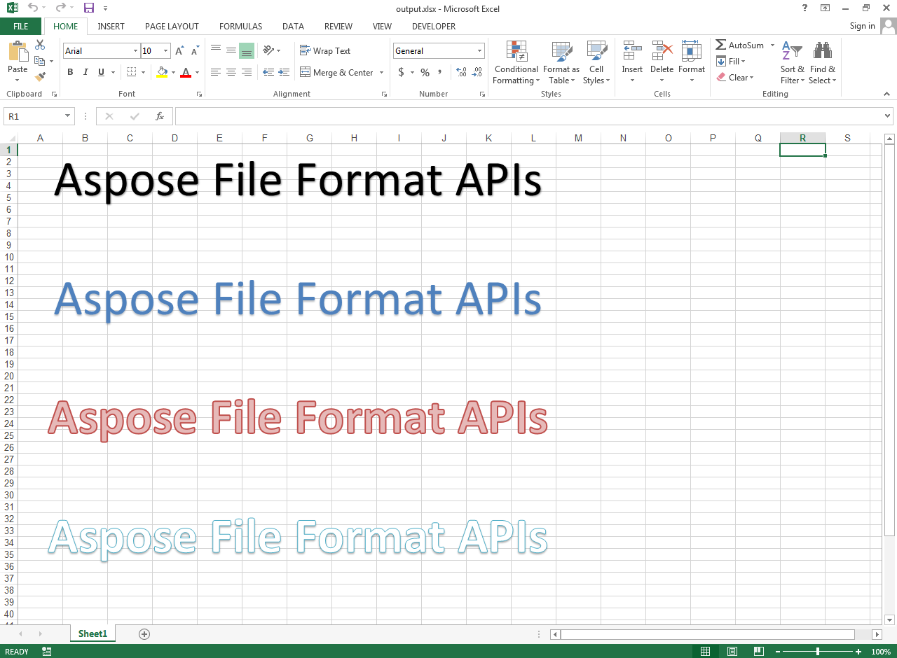

## **Possible Usage Scenarios**
You can add Word Art text with built‑in styles using Aspose.Cells. Please use [ShapeCollection.AddWordArt()](https://reference.aspose.com/cells/net/aspose.cells.drawing/shapecollection/methods/addwordart) method for this purpose.

## **Add Word Art Text with Built-in Styles**
The following sample code adds Word Art text with different built‑in styles. Please check the [output Excel file](5115470.xlsx) generated with this code. This is how the [output Excel file](5115470.xlsx) looks in Microsoft Excel.



