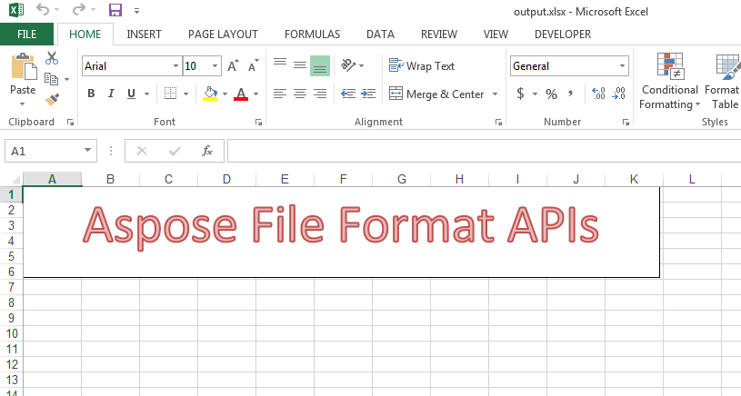

## **Possible Usage Scenarios**
You can apply a preset WordArt style to the text of the shape using Aspose.Cells. Please use [FontSetting.SetWordArtStyle()](https://reference.aspose.com/cells/net/aspose.cells/fontsetting/methods/setwordartstyle) or [FontSettingCollection.SetWordArtStyle()](https://reference.aspose.com/cells/net/aspose.cells.drawing.texts/fontsettingcollection/methods/setwordartstyle) methods for this purpose.

## **Set a preset WordArt style to the text of the shape**
The following sample code creates a text box with some text and then sets a preset WordArt style for its text using [FontSetting.SetWordArtStyle()](https://reference.aspose.com/cells/net/aspose.cells/fontsetting/methods/setwordartstyle) method. This is how the [output Excel file](5115445.xlsx) looks in Microsoft Excel.



