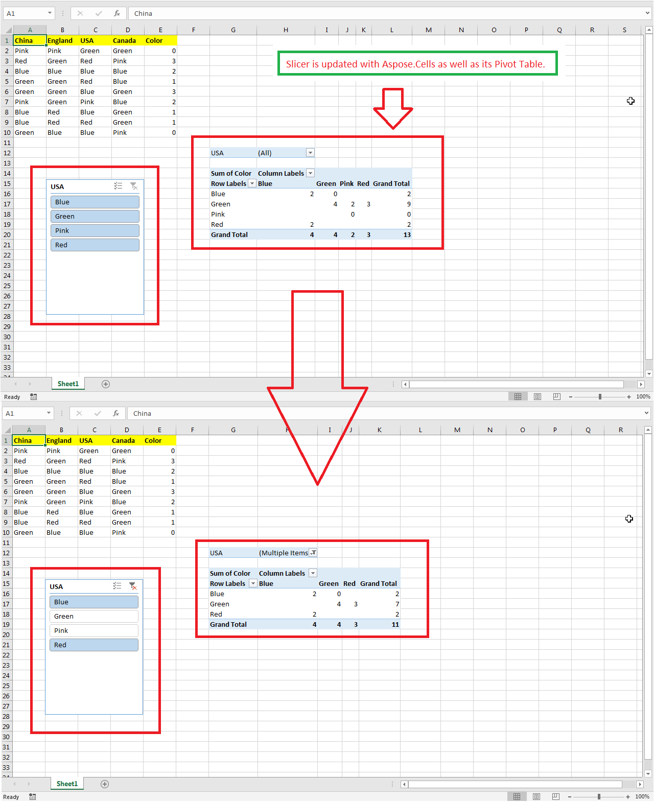

## **Possible Usage Scenarios**

If you want to update slicer in Microsoft Excel, select or unselect its items, it will then update the slicer table or pivot table accordingly. Please use [**Slicer.SlicerCache.SlicerCacheItems**](https://reference.aspose.com/cells/net/aspose.cells.slicers/slicercache/properties/slicercacheitems) to select or unselect slicer items with Aspose.Cells and then call [**Slicer.Refresh()**](https://reference.aspose.com/cells/net/aspose.cells.slicers/slicer/methods/refresh) method to update the slicer table or pivot table.

## **How to Update Slicer**

The following sample code loads the [sample Excel file](67338475.xlsx) that contains an existing slicer. It unselects the 2nd and 3rd items of the slicer and refreshes the slicer. It then saves the workbook as [output Excel file](67338476.xlsx). The following screenshot shows the effect of the sample code on the sample Excel file. As you can see in the screenshot, refreshing the slicer with selected items has also refreshed the pivot table accordingly.

## **Sample Code**


