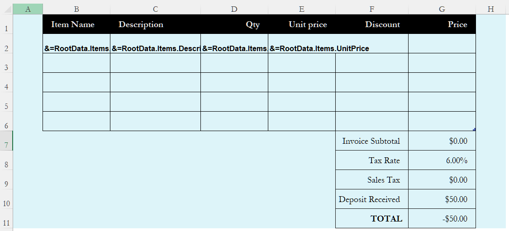
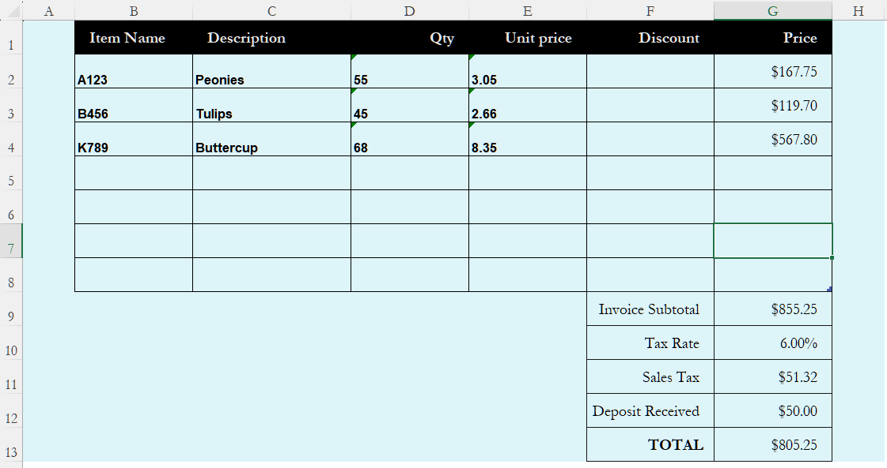

## **Why Importing Data to Excel With Smart Markers**
Using Smart Markers to import data into Excel streamlines data integration by combining template-based design with dynamic data binding. This approach is particularly valuable in tools like Aspose.Cells, where markers act as placeholders in templates to auto-populate data from diverse sources. Below are the key reasons for adopting this method:

1. Efficiency in Repetitive Reporting: Template Reusability, Pre-designed Excel templates with embedded markers (e.g., &=$VariableName, &=DataSource.Field) can be reused across multiple datasets, eliminating manual reformatting. For example, financial reports or inventory sheets only require updating the data source, not rebuilding layouts. Automated Data Binding, Smart Markers link directly to data sources (e.g., databases, JavaBeans, arrays). Changes in source data automatically reflect in the output Excel file after processing, reducing copy-paste errors.

2. Support for Complex Data Structures: Multi-Source Integration, A single template can merge data from varied sources (e.g., variables, arrays, ResultSets). Hierarchical Data Handling, Nested data (e.g., grouped records) can be processed using markers like &=subtotal9:Person.id to generate summaries (sums, averages) per group directly in Excel.

3. Preservation of Excel Functionality: Smart Markers coexist with Excel features like formulas, conditional formatting, and charts. For example: Dynamic calculations using &==C{r}*D{r} apply row-specific formulas during data injection. Templates retain pre-defined styles (e.g., headers, cell colors), ensuring consistency without post-import adjustments.

4. Advanced Automation Capabilities: Custom Data Source Integration, Developers can implement interfaces like ICellsDataTable (in .NET) to map proprietary data structures to markers. This flexibility supports real-time data from APIs or sensors. Batch Processing, Tools like Aspose.Cells’ WorkbookDesigner enable bulk operations (e.g., generating 1,000+ invoices in one run) by looping through datasets.

5. Reduced Development and Maintenance Effort: Separation of Logic and Design, Designers manage templates in Excel (no coding), while developers handle data logic. This division accelerates iterations. Error Reduction, Automated data mapping minimizes manual entry risks. For example, sensor data analyzed in VC++ can be auto-filled into Excel templates via object interfaces, avoiding transcription mistakes.

## **Sample Code for Importing DataTable With Smart Markers**
The following sample code has a data source that has 6 records. We want to show only 3 records in one worksheet, then the rest of the records will automatically move to the second worksheet. Please note, the second worksheet should also have the same smart marker tag and you must call [WorkbookDesigner.Process(sheetIndex, isPreserved)](https://reference.aspose.com/cells/net/aspose.cells.workbookdesigner/process/methods/2) method for both sheets. Please see the [output Excel file](SmartMarkerDataTableToExcel.xlsx) generated by the code for a reference.



## **Sample Code for Importing JSON Data With Smart Markers**
Aspose.Cells for .NET supports json data in smart markers. The sample code loads a table template, intelligently imports JSON data for filling, and then calculates the table data. Please check [template file](table.xlsx), [json file](table.json) and the screenshot of the output excel file generated with the following code.

|**The first worksheet of the table.xlsx file showing smart markers.**|
| :- |
||

|**The screenshot of the output excel file.**|
| :- |
||

Json data as follows:
```json data
{
	"Items" : [
		{
			"ItemName" : "A123",
			"Description" : "Peonies",
			"Qty" : "55",
			"UnitPrice" : "3.05"			
		},
		{
			"ItemName" : "B456",
			"Description" : "Tulips",
			"Qty" : "45",
			"UnitPrice" : "2.66",
		},
		{
			"ItemName" : "K789",
			"Description" : "Buttercup",
			"Qty" : "68",
			"UnitPrice" : "8.35",
		}
	]
}
```
The example that follows shows how this works.



## **Sample Code for Importing Nested Objects With Smart Markers**
Aspose.Cells supports nested objects in smart markers, the nested objects should be simple. We use a simple template file. See the designer spreadsheet that contains some nested smart markers.

|**The first worksheet of the SM_NestedObjects.xlsx file showing nested smart markers.**|
| :- |
||
The example that follows shows how this works.





## **Advance topics**
- [Smart Marker Parameters](/cells/net/smart-marker-parameters/)
- [Adding Anonymous or Custom Object into SmartMarkers](/cells/net/adding-anonymous-or-custom-object-into-smartmarkers/)
- [Auto Populate Smart Marker Data to Other Worksheets if Data is too Large](/cells/net/auto-populate-smart-marker-data-to-other-worksheets-if-data-is-too-large/)
- [Formatting Smart Markers](/cells/net/formatting-smart-markers/)
- [Getting Notifications while Merging Data with Smart Markers](/cells/net/getting-notifications-while-merging-data-with-smart-markers/)
- [Set custom DataSource for WorkbookDesigner](/cells/net/set-custom-datasource-for-workbookdesigner/)
- [Show leading apostrophe in cells](/cells/net/show-leading-apostrophe-in-cells/)
- [Using Formula parameter in Smart Marker field](/cells/net/using-formula-parameter-in-smart-marker-field/)
- [Smartly Importing Array Element by Index into Excel With Smart Markers](/cells/net/how-to-import-array-element-by-index-with-smart-markers/)
- [Smartly Importing Array Element by Slicer into Excel With Smart Markers](/cells/net/how-to-import-array-element-by-slicer-with-smart-markers/)
- [Smartly Importing JSON into Excel With Smart Markers](/cells/net/how-to-import-json-into-excel-with-smart-markers/)
- [Smartly Importing Nested Objects into Excel With Smart Markers](/cells/net/how-to-import-nested-objects-with-smart-markers/)
- [Smartly Importing Variable Arrays into Excel With Smart Markers](/cells/net/how-to-import-variable-arrays-with-smart-markers/)
- [How to Use Image Markers in Smart Markers](/cells/net/how-to-use-image-markers-in-smart-markers/)
- [How to Group Data in Smart Markers](/cells/net/how-to-group-data-in-smart-markers/)

