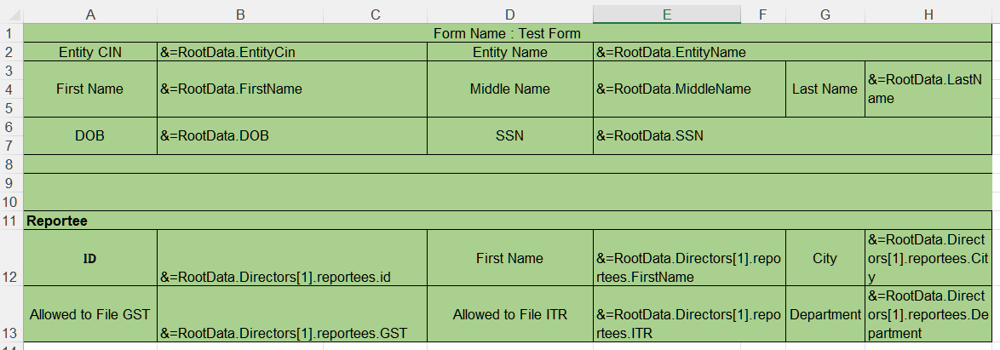
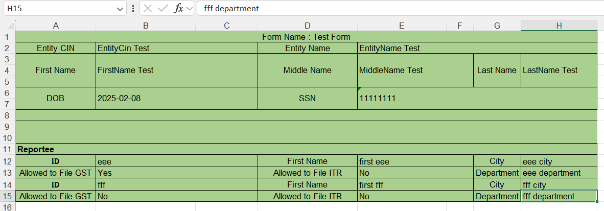

## **Why Accessing Array Element by Index**
Accessing array elements by index in Smart Markers (a feature in programming tools or languages, often used for data binding or templating) is fundamental for precision, efficiency, and simplicity.

1. Direct Positional Access: Arrays store elements in sequential memory locations. Indexing (e.g., array[0]) provides instant access to a specific position without scanning the entire array.
2. Zero-Based Indexing Standard: Most programming languages (C, Java, JavaScript, etc.) use zero-based indexing. Adopting this convention ensures consistency across Smart Markers implementations.
3. Iteration and Automation: Smart Markers often process arrays dynamically (e.g., generating UI components from data).
4. Predictability in Data Binding: In templating systems (e.g., JSX, Angular, or custom Smart Markers), indices provide unambiguous references.
5. Performance Optimization: Indexed access is O(1) time complexity – far faster than searching by value (O(n)).
6. In summary, index-based access in Smart Markers balances speed, simplicity, and control – aligning with low-level computing principles while enabling high-level abstractions. 

## **How to Import Array Element by Index into Excel With Smart Markers**
Aspose.Cells supports accessing array element by index in smart markers. Please check [template file](ElementByIndex.xlsx), [json file](ElementByIndex.json) and the screenshot of the output excel file generated with the following code.

|**The first worksheet of the smartmarker.xlsx file showing smart markers.**|
| :- |
||

|**The screenshot of the output excel file.**|
| :- |
||

Json data as follows:
```json data
{
  "EntityCin": "EntityCin Test",
  "EntityName": "EntityName Test",
  "FirstName": "FirstName Test",
  "MiddleName": "MiddleName Test",
  "LastName": "LastName Test",
  "DOB": "2025-02-08",
  "SSN": "11111111",
  "Directors": [
    {
      "id": "director id 1",
      "FirstName": "director first 1",
      "MiddleName": "director middle 1",
      "LastName": "director last 1",
      "Reportees": [
        {
          "id": "aaa",
          "FirstName": "first aaa",
          "MiddleName": "middle aaa",
          "LastName": "last aaa",
          "Department": "aaa department",
          "City": "aaa city",
          "GST": "Yes",
          "ITR": "No"
        },
        {
          "id": "bbb",
          "FirstName": "first bbb",
          "MiddleName": "middle bbb",
          "LastName": "last bbb",
          "Department": "bbb department",
          "City": "bbb city",
          "GST": "Yes",
          "ITR": "Yes"
        },
        {
          "id": "ccc",
          "FirstName": "first ccc",
          "MiddleName": "middle ccc",
          "LastName": "last ccc",
          "Department": "ccc department",
          "City": "ccc city",
          "GST": "No",
          "ITR": "No"
        }
      ]
    },
    {
      "id": "director id 2",
      "FirstName": "director first 2",
      "MiddleName": "director middle 2",
      "LastName": "director last 2",
      "Reportees": [
        {
          "id": "eee",
          "FirstName": "first eee",
          "MiddleName": "middle eee",
          "LastName": "last eee",
          "Department": "eee department",
          "City": "eee city",
          "GST": "Yes",
          "ITR": "No"
        },
        {
          "id": "fff",
          "FirstName": "first fff",
          "MiddleName": "middle fff",
          "LastName": "last fff",
          "Department": "fff department",
          "City": "fff city",
          "GST": "No",
          "ITR": "No"
        }
      ]
    }
  ]
}
```
The example that follows shows how this works.



