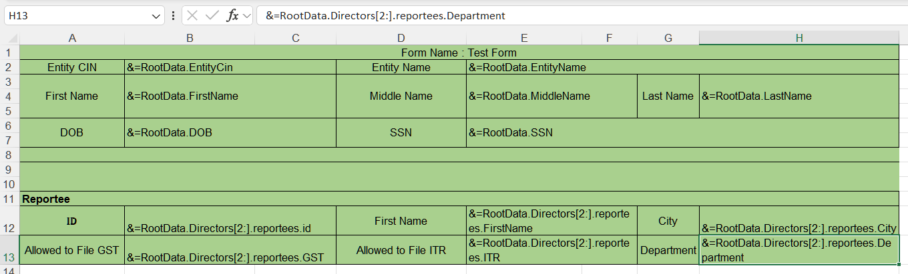
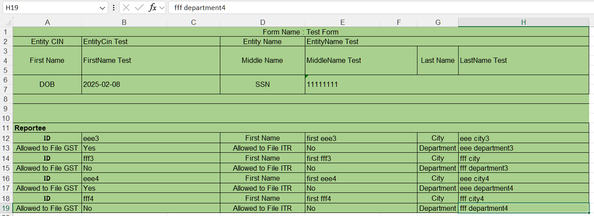

## **Why Accessing Array Element by Slicer in Smart Markers**
In FastReport's Smart Markers, accessing array elements using a slicer (e.g., [array[1..3]]) provides a concise, efficient way to work with subsets of data.

1. Simplified Data Extraction: Manually iterating over large arrays requires loops and complex syntax. Slicers let you extract ranges (subarrays) in one line. Example: [Products[1..5].Name] fetches names of the first 5 products.
2. Dynamic Reporting: Generate reports for variable data slices (e.g., "Top N items," paginated views). Example: [Sales[0..{PageNo*10}]] dynamically loads data chunks for multi-page reports.
3. Performance Optimization: Avoid loading entire arrays into memory. Fetch only needed elements. Example: [Logs[^10..^1]] retrieves the last 10 entries efficiently.
4. Declarative Syntax: Express intent directly in template markers. Example: [Employees[3..7].Department] clearly selects departments from entries 3 to 7.
5. Integration with Data Sources: Works with arrays from databases, JSON, or code. Example: Bind Invoice.Items[0..2] to display the first 3 line items.
6. Slicers in Smart Markers reduce code complexity, improve readability, and optimize data handling for array subsets. Use them when you need quick, range-based access—ideal for pagination, top-N lists, or windowed data views. 

## **How to Access Array Element by Slicer in Smart Markers**
Aspose.Cells supports accessing array element by slicer in smart markers. Please check [template file](ElementBySlicer.xlsx), [json file](ElementBySlicer.json) and the screenshot of the output excel file generated with the following code.

|**The first worksheet of the smartmarker.xlsx file showing smart markers.**|
| :- |
||

|**The screenshot of the output excel file.**|
| :- |
||

Json data as follows:
```json data
{
  "EntityCin": "EntityCin Test",
  "EntityName": "EntityName Test",
  "FirstName": "FirstName Test",
  "MiddleName": "MiddleName Test",
  "LastName": "LastName Test",
  "DOB": "2025-02-08",
  "SSN": "11111111",
  "Directors": [
    {
      "id": "director id 1",
      "FirstName": "director first 1",
      "MiddleName": "director middle 1",
      "LastName": "director last 1",
      "Reportees": [
        {
          "id": "aaa",
          "FirstName": "first aaa",
          "MiddleName": "middle aaa",
          "LastName": "last aaa",
          "Department": "aaa department",
          "City": "aaa city",
          "GST": "Yes",
          "ITR": "No"
        },
        {
          "id": "bbb",
          "FirstName": "first bbb",
          "MiddleName": "middle bbb",
          "LastName": "last bbb",
          "Department": "bbb department",
          "City": "bbb city",
          "GST": "Yes",
          "ITR": "Yes"
        },
        {
          "id": "ccc",
          "FirstName": "first ccc",
          "MiddleName": "middle ccc",
          "LastName": "last ccc",
          "Department": "ccc department",
          "City": "ccc city",
          "GST": "No",
          "ITR": "No"
        }
      ]
    },
    {
      "id": "director id 2",
      "FirstName": "director first 2",
      "MiddleName": "director middle 2",
      "LastName": "director last 2",
      "Reportees": [
        {
          "id": "eee",
          "FirstName": "first eee",
          "MiddleName": "middle eee",
          "LastName": "last eee",
          "Department": "eee department",
          "City": "eee city",
          "GST": "Yes",
          "ITR": "No"
        },
        {
          "id": "fff",
          "FirstName": "first fff",
          "MiddleName": "middle fff",
          "LastName": "last fff",
          "Department": "fff department",
          "City": "fff city",
          "GST": "No",
          "ITR": "No"
        }
      ]
    },
    {
      "id": "director id 3",
      "FirstName": "director first 2",
      "MiddleName": "director middle 2",
      "LastName": "director last 2",
      "Reportees": [
        {
          "id": "eee3",
          "FirstName": "first eee3",
          "MiddleName": "middle eee3",
          "LastName": "last eee3",
          "Department": "eee department3",
          "City": "eee city3",
          "GST": "Yes",
          "ITR": "No"
        },
        {
          "id": "fff3",
          "FirstName": "first fff3",
          "MiddleName": "middle fff3",
          "LastName": "last fff3",
          "Department": "fff department3",
          "City": "fff city",
          "GST": "No",
          "ITR": "No"
        }
      ]
    },
    {
      "id": "director id 4",
      "FirstName": "director first 4",
      "MiddleName": "director middle 4",
      "LastName": "director last 4",
      "Reportees": [
        {
          "id": "eee4",
          "FirstName": "first eee4",
          "MiddleName": "middle eee4",
          "LastName": "last eee4",
          "Department": "eee department4",
          "City": "eee city4",
          "GST": "Yes",
          "ITR": "No"
        },
        {
          "id": "fff4",
          "FirstName": "first fff4",
          "MiddleName": "middle fff4",
          "LastName": "last fff4",
          "Department": "fff department4",
          "City": "fff city4",
          "GST": "No",
          "ITR": "No"
        }
      ]
    }
  ]
}
```
The example that follows shows how this works.



