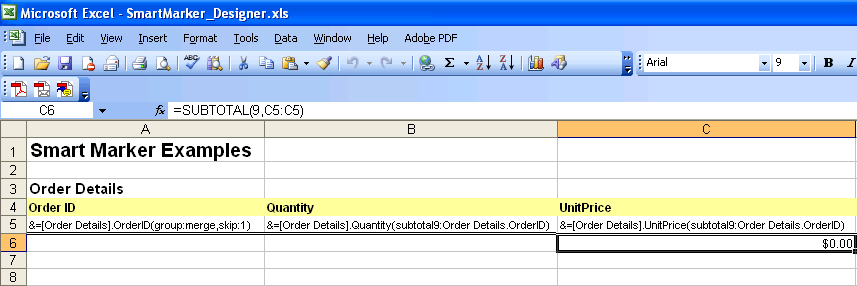

## **Possible Usage Scenarios**
In some Excel reports you might need to break the data into groups to make it easier to read and analyze. One of the primary purposes for breaking data into groups is to run calculations (perform summary operations) on each group of records.

Aspose.Cells smart markers allow you to group data by fields and place summary rows in between data sets or data groups. For example, if grouping data by `Customers.CustomerID`, you can add a summary record every time the group changes.

## **Group Data Parameters in Smart Markers**
Following are some of the smart marker parameters used for grouping data.

### **group:normal/merge/repeat**
We support three types of groups that you can choose between.

- **normal** – The group‑by field(s) value is not repeated for the corresponding records in the column; instead it is printed once per data group.
- **merge** – The same behavior as for the normal parameter, except that it merges the cells in the group‑by field(s) for each group set.
- **repeat** – The group‑by field(s) value is repeated for the corresponding records.

For example: `&=Customers.CustomerID(group:merge)`

### **skip**
Skips a specified number of rows after each group.

For example, `&=Employees.EmployeeID(group:normal,skip:1)`

### **subtotalN**
Performs a summary operation for a specified field’s data related to a group‑by field. The **N** represents numbers between 1 and 11 which specify the function used when calculating subtotals within a list of data (1 = AVERAGE, 2 = COUNT, 3 = COUNTA, 4 = MAX, 5 = MIN, … 9 = SUM, etc.). Refer to the Subtotal reference in Microsoft Excel’s help for further details.

The format is: `subtotalN:Ref`, where **Ref** refers to the group‑by column.

For example:

- `&=Products.Units(subtotal9:Products.ProductID)` specifies a summary function on the **Units** field with respect to the **ProductID** field in the **Products** table.  
- `&=Tabx.Col3(subtotal9:Tabx.Col1)` specifies a summary function on the **Col3** field grouped by **Col1** in the table **Tabx**.  
- `&=Table1.ColumnD(subtotal9:Table1.ColumnA&Table1.ColumnB)` specifies a summary function on the **ColumnD** field grouped by **ColumnA** and **ColumnB** in the table **Table1**.

## **How to Group Data in Smart Markers**

This example shows some of the grouping parameters in action. It uses the **Northwind.mdb** Microsoft Access database and extracts data from the table named **Order Details**. We create a designer file called **SmartMarker_Designer.xls** in Microsoft Excel and put smart markers into various cells on the worksheets. The markers are processed to fill the worksheets. The data is placed and organized by a group field.

The designer file has two worksheets. In the first worksheet we put smart markers with grouping parameters as shown in the screenshot below. Three smart markers (with grouping parameters) are placed:

- `&=[Order Details].OrderID(group:merge,skip:1)`,
- `&=[Order Details].Quantity(subtotal9:Order Details.OrderID)`, and
- `&=[Order Details].UnitPrice(subtotal9:Order Details.OrderID)`

These go into **A5**, **B5**, and **C5** respectively.

|**The first worksheet in the SmartMarker_Designer.xls file, complete with smart markers**|
| :- |
||

In the second worksheet of the designer file, we put some more smart markers as shown in the figure below. We place the following smart markers:

- `&=[Order Details].OrderID(group:normal)`,
- `&=[Order Details].Quantity`,
- `&=[Order Details].UnitPrice`,
- `&=&=B(r)*C(r)`, and
- `&=subtotal9:Order Details.OrderID`

These are placed in **A5**, **B5**, **C5**, **D5**, and **C6** respectively.

|**The second worksheet of the SmartMarker_Designer.xls file, showing mixed smart markers.**|
| :- |
||

Here is the source code used in the example.



{} 
If you need to add your own custom labels to the summary rows or you want to concatenate the field’s name with a label (e.g., “Subtotal of Orders”), Aspose.Cells provides you with **Label** and **LabelPosition** attributes, so you may place your custom labels in the smart markers while concatenating with the subtotal rows in grouped data. See the document on how to **Add Custom Labels to Concatenate with the Subtotal Rows in Smart Markers** for your reference.  
{}
