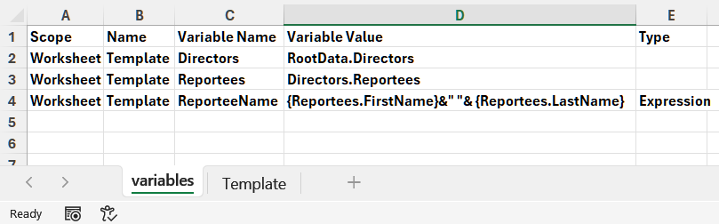
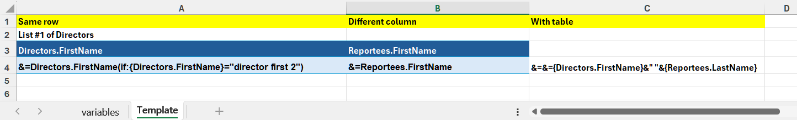
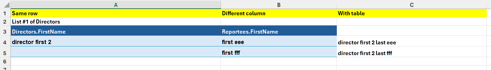

## **Why Use If Parameter and Variables in Smart Markers**
Smart Markers are powerful tools used in various contexts. The use of parameters and variables within Smart Markers significantly enhances their flexibility, efficiency, and functionality.

1. Dynamic Data Handling and Flexibility: Parameters and variables allow Smart Markers to handle data dynamically, adapting to changing inputs without requiring manual adjustments to the template or code.  
2. Control Over Behavior and Operations: Parameters fine‑tune the behavior of Smart Markers, enabling operations like grouping, sorting, subtotaling, and conditional formatting.  
3. Support for Complex Data Structures: Variables enable Smart Markers to work with complex data sources, including arrays, objects, and multi‑dimensional data.  
4. Efficiency and Automation: Parameters and variables automate repetitive tasks, reducing manual effort and potential errors.  
5. Conditional Logic and Filtering: Though limited in some contexts, parameters and variables can implement conditional logic.  
6. Customization and User Interaction: Variables allow user inputs to customize Smart Marker behavior dynamically.  
7. Performance Optimization: Parameters help optimize performance by controlling how data is processed.  


## **How to Use If Parameter and Variables in Smart Markers**
Sometimes, you need to add an if‑condition judgment to variable parameters in Smart Markers. Aspose.Cells makes it possible to use the If parameter and variables in Smart Markers. Please check the [template file](template.xlsx), the [JSON file](data.json), and the screenshot of the output Excel file generated with the following code.

| **The first worksheet of the template.xlsx file showing variables.** |
| :- |
|  |

| **The second worksheet of the template.xlsx file showing smart markers.** |
| :- |
|  |

| **The screenshot of the output Excel file.** |
| :- |
|  |

JSON data as follows:
```json
{
    "Directors": [
        {
            "FirstName": "director first 1",
            "id": "director id 1",
            "LastName": "director last 1",
            "MiddleName": "director middle 1",
            "Reportees": [
                {
                    "City": "aaa city",
                    "Department": "aaa department",
                    "FirstName": "first aaa",
                    "GST": "Yes",
                    "id": "aaa",
                    "ITR": "No",
                    "LastName": "last aaa",
                    "MiddleName": "middle aaa"
                },
                {
                    "City": "bbb city",
                    "Department": "bbb department",
                    "FirstName": "first bbb",
                    "GST": "Yes",
                    "id": "bbb",
                    "ITR": "Yes",
                    "LastName": "last bbb",
                    "MiddleName": "middle bbb"
                },
                {
                    "City": "ccc city",
                    "Department": "ccc department",
                    "FirstName": "first ccc",
                    "GST": "No",
                    "id": "ccc",
                    "ITR": "No",
                    "LastName": "last ccc",
                    "MiddleName": "middle ccc"
                }
            ]
        },
        {
            "FirstName": "director first 2",
            "id": "director id 2",
            "LastName": "director last 2",
            "MiddleName": "director middle 2",
            "Reportees": [
                {
                    "City": "eee city",
                    "Department": "eee department",
                    "FirstName": "first eee",
                    "GST": "Yes",
                    "id": "eee",
                    "ITR": "No",
                    "LastName": "last eee",
                    "MiddleName": "middle eee"
                },
                {
                    "City": "fff city",
                    "Department": "fff department",
                    "FirstName": "first fff",
                    "GST": "No",
                    "id": "fff",
                    "ITR": "No",
                    "LastName": "last fff",
                    "MiddleName": "middle fff"
                }
            ]
        }
    ],
    "DOB": "2025-02-08",
    "EntityCin": "EntityCin Test",
    "EntityName": "EntityName Test",
    "FirstName": "FirstName Test",
    "LastName": "LastName Test",
    "MiddleName": "MiddleName Test",
    "SSN": "11111111"
}
```

The example that follows shows how this works.




