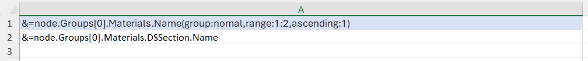
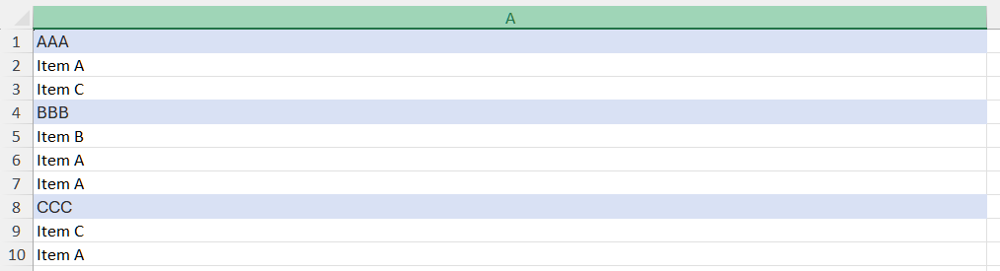

## **Why Using Range Parameter in Smart Markers**
The range parameter in SmartMarkers is used to precisely control where and how data is placed in an Excel template when populating it with data from a source (e.g., JSON, databases). It helps manage dynamic data output, especially when dealing with variable-length arrays or complex groupings.

1. Control Data Placement and Avoid Overlap: When data sources contain dynamic arrays (e.g., varying number of elements per record), the range parameter ensures data is populated within a defined Excel range, preventing overflow into adjacent cells or sections.

2. Handle Dynamic Array Formulas: For operations like transposing dynamic arrays (e.g., &=TRANSPOSE(DataArray)), the range parameter ensures the output adapts to the actual data size without leaving residual values (e.g., zeros in empty fields) from previous operations.

3. Support Grouping and Hierarchical Data: When data requires grouping (e.g., nested JSON structures), the range parameter helps define hierarchical output areas. For instance, grouping records under a parent category without manual row adjustments. Without a defined range, SmartMarkers might fail to represent nested relationships accurately, especially if data sources lack explicit hierarchies.

4. Improve Template Design and Consistency: By specifying ranges, users ensure that formatting, formulas, and borders are applied consistently to the output area. This avoids issues like inconsistent cell styling or broken formulas in generated reports.

5. Optimize Performance and Data Sorting: The range parameter allows tools to pre-sort data sources before populating templates, ensuring grouped data appears in the correct order.

## **How to Use Range Parameter in SmartMarkers**
Sometimes, you need to sort and perform other operations on a range in SmartMarkers. Aspose.Cells makes it possible to use range parameter in SmartMarkers. Please check [template file](range.xlsx), [json file](range.json) and the screenshot of the output excel file generated with the following code.

|**The first worksheet of the range.xlsx file showing smart markers.**|
| :- |
||

|**The screenshot of the output excel file.**|
| :- |
||

Json data as follows:
```json data
{
  "Groups": [
    {
      "Materials": [
        { 
	        "Name": "BBB", 
	        "DSSection": { "Name": "Item B" } 
	      },
        {
          "Name": "CCC",
          "DSSection": { "Name": "Item C" }
        },
        {
          "Name": "AAA",
          "DSSection": { "Name": "Item A" }
        },        
        {
          "Name": "BBB",
          "DSSection": { "Name": "Item A" }
        },
        {
          "Name": "CCC",
          "DSSection": { "Name": "Item A" }
        },
        {
          "Name": "BBB",
          "DSSection": { "Name": "Item A" }
        },
        { 
	        "Name": "AAA", 
	        "DSSection": { "Name": "Item C" } 
        }
      ]
    }
  ]
}
```
The example that follows shows how this works.



