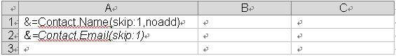

## **Designer Spreadsheet & Smart Markers**
Designer spreadsheets are standard Excel files that contain visual formatting, formulas and smart markers. They can contain smart markers that reference one or more data source, such as information from a project and information for related contacts. Smart markers are written into the cells where you want the information.

All smart markers start with &=. An example of a data marker is &=Party.FullName. If the data marker results in more than one item, for example, a complete row, then the following rows are moved down automatically to make room for the new information. Thus sub-totals and totals can be placed on the row immediately after the data marker to make calculations based on the inserted data. To make calculations on the inserted rows, use **dynamic formulas**.

Smart markers consist of the **data source** and **field name** parts for most information. Special information may also be passed with variables and variable arrays. Variables always fill only one cell whereas variable arrays may fill several. Only use one data marker per cell. Unused smart markers are removed.

Smart marker may also contain parameters. Parameters allow you to modify how the information is laid out. They are appended to the end of the smart marker in parenthesis as a comma separated list.

## **Smart Marker Options**

```csharp
&=DataSource.FieldName 
&=[Data Source].[Field Name] 
&=$VariableName 
&=$VariableArray 
&==DynamicFormula 
&=&=RepeatDynamicFormula
```
## **Smart Marker Parameters**
The following parameters are allowed:

- **noadd** - Do not add extra rows to fit data.
- **skip:n** - Skip n number of rows for each row of data.
- **ascending:n** or **descending:n** - Sort data in smart markers. If n is 1, then the column is the first key of the sorter. The data is sorted after processing the data source. For example: &=Table1.Field3(ascending:1).
- **horizontal** - Write data left-to-right, instead of top-to-bottom.
- **numeric** - Convert text to number if possible.
- **shift** - Shift down or right, creating extra rows or columns to fit data. The shift parameter works the same way as in Microsoft Excel. For example in Microsoft Excel, when you select a range of cells, right-click and select **Insert** and specify **shift cells down**, **shift cells right** and other options. In short, the **shift** parameter fills the same function for vertical/normal (top to bottom) or horizontal (left to right) smart markers.
- **copystyle** - Copy the base cell's style to all the cells in that column.

The parameters noadd and skip can be combined to insert data on alternating rows. Because the template is processed from bottom to top, you should add noadd on the first row to avoid extra rows from being inserted before the alternate row.

If you have multiple parameters, separate them with a commas, but no space: parameterA,parameterB,parameterC

The following screenshots show how to insert data on every other row.

|**Template File**|**Output File**|
| :- | :- |
|||

## **Dynamic Formulas**
Dynamic formulas allow you to insert Excel formulas into cells even when the formula references rows that will be inserted during the export process. Dynamic formulas can repeat for each inserted row or use only the cell where the data marker is placed.

Dynamic formulas allow the following additional options:

- r - Current row number.
- 2, -1 - Offset to current row number.

For example:



 &=&=B{-1}/C{-1}~(skip:1)



In the dynamic formula marker, "-1" denotes the offset to the current row in B and C columns respectively which will be set for division operation, the skip parameter is one row. Moreover, we should specify the following char:



 "~"



as a separator character to apply further parameters in dynamic formulas.

The following screenshots illustrate a repeating dynamic formula and the resulting Excel worksheet.

|**Template File**|**OutPut File**|
| :- | :- |
|||
Cell "C1" contains the formula **= A1*B1**, cell "C2" contains **= A2*B2** and cell "C3" contains **= A3*B3**.

It's very easy to process the smart markers. Following example code shows on how to use dynamic formulas in Smart Markers. We load the [template file](templateDynamicFormulas.xlsx) and create test data, process the markers to fill data into the cells against the marker. 



## **How to Use Dynamic Formulas and Variables in SmartMarkers**
Sometimes, you need to use dynamic formulas and variables in SmartMarkers. For dynamic formulas, please add special char (~) as a separator. Aspose.Cells makes it possible to use dynamic formulas and variables in SmartMarkers. Please check [template file](template.xlsx), [json file](employees-data.json) and the screenshot of the output excel file generated with the following code.

|**The first worksheet of the template.xlsx file showing variables.**|
| :- |
||

|**The second worksheet of the template.xlsx file showing smart markers.**|
| :- |
||

|**The screenshot of the output excel file.**|
| :- |
||

Json data as follows:
```json data
{
  "RootData": {
    "Directors": [
      {
        "FirstName": "director first 1",
        "id": "director id 1",
        "LastName": "director last 1",
        "MiddleName": "director middle 1",
        "Reportees": [
          {
            "City": "aaa city",
            "Department": "aaa department",
            "FirstName": "first aaa",
            "GST": "Yes",
            "id": "aaa",
            "ITR": "No",
            "LastName": "last aaa",
            "MiddleName": "middle aaa"
          },
          {
            "City": "bbb city",
            "Department": "bbb department",
            "FirstName": "first bbb",
            "GST": "Yes",
            "id": "bbb",
            "ITR": "Yes",
            "LastName": "last bbb",
            "MiddleName": "middle bbb"
          },
          {
            "City": "ccc city",
            "Department": "ccc department",
            "FirstName": "first ccc",
            "GST": "No",
            "id": "ccc",
            "ITR": "No",
            "LastName": "last ccc",
            "MiddleName": "middle ccc"
          },
          {
            "City": "ddd city",
            "Department": "ddd department",
            "FirstName": "first ddd",
            "GST": "No",
            "id": "ddd",
            "ITR": "No",
            "LastName": "last ddd",
            "MiddleName": "middle ddd"
          },
          {
            "City": "eee city",
            "Department": "eee department",
            "FirstName": "first eee",
            "GST": "No",
            "id": "eee",
            "ITR": "No",
            "LastName": "last eee",
            "MiddleName": "middle eee"
          }
        ]
      },
      {
        "FirstName": "director first 2",
        "id": "director id 2",
        "LastName": "director last 2",
        "MiddleName": "director middle 2",
        "Reportees": [
          {
            "City": "eee city",
            "Department": "eee department",
            "FirstName": "first eee",
            "GST": "Yes",
            "id": "eee",
            "ITR": "No",
            "LastName": "last eee",
            "MiddleName": "middle eee"
          },
          {
            "City": "fff city",
            "Department": "fff department",
            "FirstName": "first fff",
            "GST": "No",
            "id": "fff",
            "ITR": "No",
            "LastName": "last fff",
            "MiddleName": "middle fff"
          }
        ]
      }
    ],
    "DOB": "2025-02-28",
    "EntityCin": "EntityCin Test",
    "EntityName": "EntityName Test",
    "FirstName": "FirstName Test",
    "LastName": "LastName Test",
    "MiddleName": "MiddleName Test",
    "SSN": "11111111",
	"CtcPerEmployee": 100000,
	"CountOfEmployees": 132
  }
}
```
The example that follows shows how this works.

