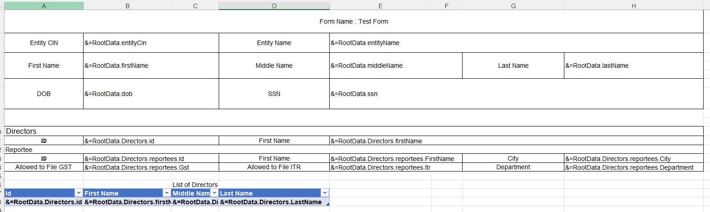

## **Why Use JSON Data for Smart Markers**
Why Use JSON Data as Original Data for Smart Markers?  
JSON (JavaScript Object Notation) is a lightweight, human‑readable data interchange format that's ideal for structuring hierarchical data. Here’s why it’s well‑suited as original data for Smart Markers (dynamic placeholders that auto‑populate spreadsheets, documents, or dashboards):

1. **Structured & Hierarchical Data Support**  
   JSON natively supports nested objects and arrays (e.g., `{ "user": { "name": "Alice", "orders": [ ... ] } }`). Smart Markers can traverse this hierarchy (e.g., `{{user.orders[0].price}}`), making it easy to map complex data to templates.

2. **Language and Platform Agnostic**  
   JSON parsers exist in virtually all programming languages (Python, JavaScript, Java, etc.). Tools like Excel Power Query, Google Apps Script, or no‑code platforms (e.g., Airtable) seamlessly ingest JSON.

3. **API‑Friendly**  
   Most modern APIs (e.g., REST, GraphQL) return data in JSON format. Smart Markers can directly consume live JSON from web services, enabling real‑time data updates (e.g., stock prices, weather).

4. **Human‑Readable & Debuggable**  
   JSON’s plain‑text structure is easy to validate (e.g., using JSONLint), edit manually or via scripts, and debug when mapping data to markers.

5. **Scalability & Flexibility**  
   Add/remove fields in JSON without breaking existing Smart Markers (if optional fields are handled gracefully). Supports diverse data types: strings, numbers, booleans, arrays, and objects.

6. **Ecosystem Compatibility**  
   Works with modern data tools: Databases (MongoDB, PostgreSQL (JSONB), etc.), automation tools (Zapier, Integromat), and data pipelines (Apache NiFi, Talend).

## **Using Excel Nested Template with JSON Data**
Aspose.Cells for .NET supports JSON data in Smart Markers; JSON data can be nested hierarchically. Please check the [template file](smartmarker.xlsx), the [JSON file](smartmarker.json), and the screenshot of the output Excel file generated with the following code.

| **The first worksheet of the smartmarker.xlsx file showing Smart Markers.** |
| :- |
|  |

| **The screenshot of the output Excel file.** |
| :- |
|  |

JSON data as follows:
```json
{
    "EntityCin" : "EntityCin Test",
    "EntityName" : "EntityName Test",
    "FirstName" : "FirstName Test",
    "MiddleName" : "MiddleName Test",
    "LastName" : "LastName Test",
    "DOB" : "2025-02-08",
    "SSN" : "11111111",
    "Directors" : [
        {
            "id" : "director id 1",
            "FirstName" : "director first 1",
            "MiddleName" : "director middle 1",
            "LastName" : "director last 1",
            "Reportees" : [
                {
                    "id" : "aaa",
                    "FirstName" : "first aaa",
                    "MiddleName" : "middle aaa",
                    "LastName" : "last aaa",
                    "Department" : "aaa department",
                    "City" : "aaa city",
                    "GST" : "Yes",
                    "ITR" : "No"
                },
                {
                    "id" : "bbb",
                    "FirstName" : "first bbb",
                    "MiddleName" : "middle bbb",
                    "LastName" : "last bbb",
                    "Department" : "bbb department",
                    "City" : "bbb city",
                    "GST" : "Yes",
                    "ITR" : "Yes"
                },
                {
                    "id" : "ccc",
                    "FirstName" : "first ccc",
                    "MiddleName" : "middle ccc",
                    "LastName" : "last ccc",
                    "Department" : "ccc department",
                    "City" : "ccc city",
                    "GST" : "No",
                    "ITR" : "No"
                }
            ]
        },
        {
            "id" : "director id 2",
            "FirstName" : "director first 2",
            "MiddleName" : "director middle 2",
            "LastName" : "director last 2",
            "Reportees" : [
                {
                    "id" : "eee",
                    "FirstName" : "first eee",
                    "MiddleName" : "middle eee",
                    "LastName" : "last eee",
                    "Department" : "eee department",
                    "City" : "eee city",
                    "GST" : "Yes",
                    "ITR" : "No"
                },
                {
                    "id" : "fff",
                    "FirstName" : "first fff",
                    "MiddleName" : "middle fff",
                    "LastName" : "last fff",
                    "Department" : "fff department",
                    "City" : "fff city",
                    "GST" : "No",
                    "ITR" : "No"
                }
            ]
        }
    ]
}
```

The example that follows shows how this works.



## **Using Excel Subtotal Template with JSON Data**
Aspose.Cells for .NET supports JSON data in Smart Markers; JSON data can be nested hierarchically. Subtotal was used for data statistics in the Excel template. Please check the [template file](jsonExcelTemplate.xlsx), the [JSON file](jsonData.json), and the screenshot of the output Excel file generated with the following code.

| **The first worksheet of the jsonExcelTemplate.xlsx file showing Smart Markers.** |
| :- |
|  |

| **The screenshot of the output Excel file.** |
| :- |
|  |

JSON data as follows:
```json
{
    "number": 10,
    "test": "test abc",
    "date": "2011-10-05T14:48:00.000Z",
    "arrayNumber": [1,2,3,4,5],
    "arrayWords": ["x1","xy2","yz3","z4"],
    "arrayOfObjects": [
      {"valNumber":12,"valString": "aa"},
      {"valNumber":15,"valString": "bb"},
      {"valNumber":1,"valString": "cc"},
      {"valNumber":20,"valString": "dd"}
    ],
    "nestedArray": [
      {"valNumber":12,"valString": "xy","nestArr": [{"val": 1,"some": "aa"}]},
      {"valNumber":15,"valString": "y","nestArr": [{"val": 2,"some": "bb"}]},
      {"valNumber":1,"valString": "yz","nestArr": [{"some": "cc"}]},
      {"valNumber":20,"valString": "z","nestArr": [{"some": "dd"}]}
    ],
    "Products": [
      { "ProductID": "A101", "ProductName": "Apples", "Units": 5 },
      { "ProductID": "A101", "ProductName": "Apples", "Units": 10 },
      { "ProductID": "B202", "ProductName": "Bananas", "Units": 7 },
      { "ProductID": "B202", "ProductName": "Bananas", "Units": 3 },
      { "ProductID": "C303", "ProductName": "Cherries", "Units": 8 }
    ]
}
```

The example that follows shows how this works.




