## **Possible Usage Scenarios**
Sometimes, you want to generate dynamic Excel reports; it includes a comprehensive main dashboard and multiple fine‑grained detailed worksheets. Among them, a single main table presents an overview, which may showcase various product variants, and each corresponding detailed worksheet provides specific and in‑depth data for a single variant. Aspose.Cells can perfectly meet your needs through master and details with smart markers.

## **Smart Marker Parameters for Master and Details**
To import master and details data into Excel, you need to use the following smart marker parameters:

| Parameter | Description | Acceptable Values (Syntax) | Restrictions | Optionality | Default Behavior | Excel Constraints |
| --- | --- | --- | --- | --- | --- | --- |
| `DetailSheet` | Specify the name of the detail worksheet stored in the template file. | String value | Value must be null or the name of a worksheet. If null, this is a detail sheet. It should be a simple string value. Variable is not supported. | If omitted, it is not a master or detail sheet. | Normal worksheet, not a master or detail sheet. | |
| `DetailTable` | Specify the table name of the detail worksheet in the template file. | String value |  | If omitted, the smart marker in the detail sheet should be similar to the master sheet; otherwise we cannot find the data source. | If omitted, the smart marker in the detail sheet should be similar to the master sheet; otherwise we cannot find the data source. | |
| `DetailSheetNewName` | Specify the name of the newly created detail worksheet. | Excel formula‑like expression | It should be a valid Excel formula if we replace the variable ({a.bc}) with a simple value. | If omitted, new sheets will be Sheet1, Sheet2… | If omitted, new sheets will be Sheet1, Sheet2… | The name must be a valid worksheet name. |
| `DetailLink` | Indicate whether to add hyperlinks to the location of the imported data. |  |  | If omitted, hyperlinks are not added to the location of the imported data. | If omitted, hyperlinks are not added to the location of the imported data. | |

## **How to Use Master and Details When Master and Details Are in One Worksheet**
Sometimes, you need to import master and details data to Excel in SmartMarkers. Aspose.Cells makes it possible to use master and details parameters in SmartMarkers. Please check the [template file](MasterDetailInOneSheet.xlsx), the [JSON file](MasterDetailData.json), and the screenshots of the output Excel file generated with the following code.

|**The first worksheet of the template.xlsx.**|
| :- |
|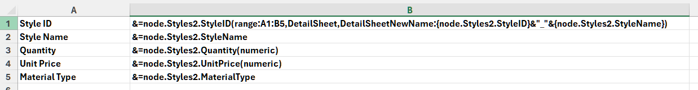|

|**The first worksheet of the output Excel file.**|
| :- |
|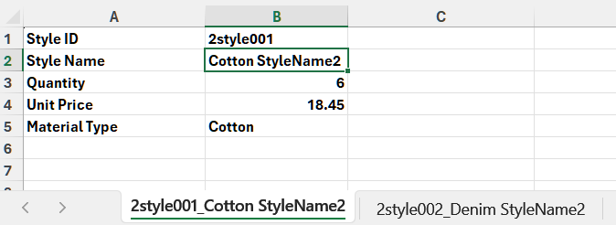|

|**The second worksheet of the output Excel file.**|
| :- |
|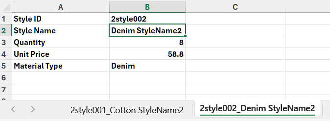|

**JSON data as follows:**
```json
{
	"node": {
		"Styles1": [
			{
				"StyleID": "1style001",
				"StyleName": "StyleName1",
				"Quantity": 6,
				"UnitPrice": 18.45,
				"MaterialType": "Cotton"
			}
		],
		"Styles2": [
			{
				"StyleID": "2style001",
				"StyleName": "Cotton StyleName2",
				"Quantity": 6,
				"UnitPrice": 18.45,
				"MaterialType": "Cotton"
			},
			{
				"StyleID": "2style002",
				"StyleName": "Denim StyleName2",
				"Quantity": 8,
				"UnitPrice": 58.8,
				"MaterialType": "Denim"
			}
		]
	}
}
```

The example that follows shows how this works.



## **How to Use Master and Details When Master and Details Are in Different Worksheets**
Sometimes, you need to import master and details data to Excel in SmartMarkers. Aspose.Cells makes it possible to use master and details parameters in SmartMarkers. Please check the [template file](MasterDetailInTwoSheets.xlsx), the [JSON file](MasterDetailData.json), and the screenshots of the output Excel file generated with the following code.

|**The first master worksheet of the template.xlsx.**|
| :- |
|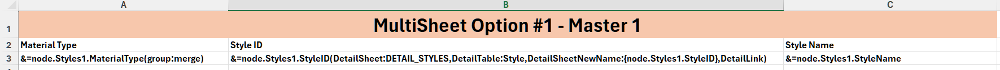|

|**The second master worksheet of the template.xlsx.**|
| :- |
|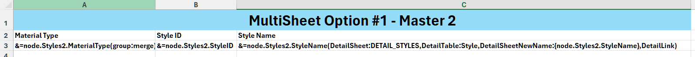|

|**The detail worksheet of the template.xlsx.**|
| :- |
|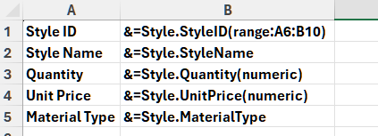|

|**The first master worksheet of the output Excel file.**|
| :- |
|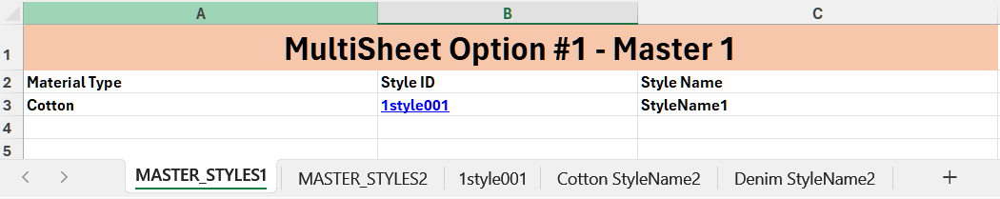|

|**The second master worksheet of the output Excel file.**|
| :- |
|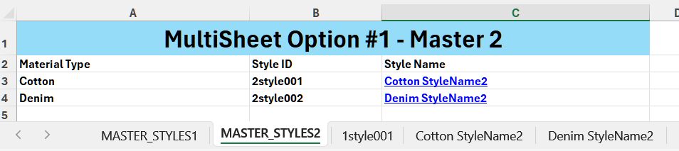|

|**The detail worksheet of the first master worksheet in the output Excel file.**|
| :- |
|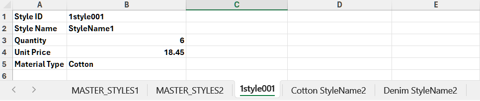|

|**The first detail worksheet of the second master worksheet in the output Excel file.**|
| :- |
|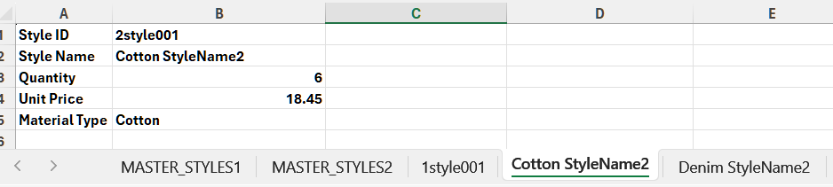|

|**The second detail worksheet of the second master worksheet in the output Excel file.**|
| :- |
|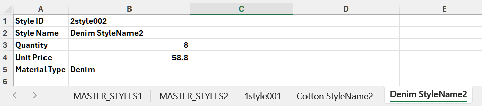|

**JSON data as follows:**
```json
{
	"node": {
		"Styles1": [
			{
				"StyleID": "1style001",
				"StyleName": "StyleName1",
				"Quantity": 6,
				"UnitPrice": 18.45,
				"MaterialType": "Cotton"
			}
		],
		"Styles2": [
			{
				"StyleID": "2style001",
				"StyleName": "Cotton StyleName2",
				"Quantity": 6,
				"UnitPrice": 18.45,
				"MaterialType": "Cotton"
			},
			{
				"StyleID": "2style002",
				"StyleName": "Denim StyleName2",
				"Quantity": 8,
				"UnitPrice": 58.8,
				"MaterialType": "Denim"
			}
		]
	}
}
```

The example that follows shows how this works.


