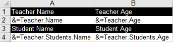

## **Why Use Nested Objects for Smart Markers**
Smart Markers (in tools like FoxPro, reporting engines, or modern template systems) are placeholders that dynamically inject data into templates. Using nested objects (e.g., <<customer.address.city>>) enhances flexibility, organization, and expressiveness.

1. **Hierarchical Data Representation:** Real‑world data is inherently nested (e.g., an Order contains a Customer, which has an Address). Nested objects mirror this structure, avoiding flattened/artificial fields like customer_city.  
2. **Avoid Naming Collisions:** Flat structures risk clashes (e.g., product_name vs. supplier_name). Nesting scopes names naturally:  
   <<product.name>> vs. <<supplier.name>>.  
3. **Modularity & Reusability:** Reuse sub‑objects across contexts. The Address object can be embedded in Customer, Vendor, or Employee markers. Changes to Address propagate universally.  
4. **Simplified Data Binding:** Bind entire nested objects to templates. <<order.customer>> auto‑expands to all customer fields. Reduces manual mapping for sub‑fields.  
5. **Dynamic Data Traversal:** Traverse relationships on‑demand. <<invoice.line_items[0].price>> accesses array elements or child objects. Enables complex queries without pre‑processing.  
6. **Clearer Template Logic:** Markers self‑document relationships; <<user.profile.email>> is more intuitive than <<user_email>>. Reduces ambiguity in large templates.  
7. **Framework/Tool Support:** Modern engines (e.g., Handlebars, React, FoxPro) natively resolve nested paths. Aligns with JSON/APIs where nested data is standard.

## **How to Import Anonymous Types or Custom Objects With Smart Markers**
Aspose.Cells also supports anonymous types or custom objects in smart markers. The example that follows shows how this works. For importing data from dynamic objects using Smart Markers, visit the following article:

[Importing from dynamic object as data source](/cells/net/import-data-into-worksheet/#importdataintoworksheet-importingfromdynamicobjectasdatasource)



## **How to Import Nested Objects With Smart Markers**
Aspose.Cells supports nested objects in smart markers; the nested objects should be simple. We use a simple template file. See the designer spreadsheet that contains some nested smart markers.

|**The first worksheet of the SM_NestedObjects.xlsx file showing nested smart markers.**|
| :- |
||

The example that follows shows how this works.



## **How to Import a Generic List as Nested Object With Smart Markers**
Aspose.Cells now also supports using a generic list as a nested object. Please check the screenshot of the output Excel file generated with the following code. As you can see in the screenshot, a Teacher object contains multiple nested Student objects.

||
| :- |



## **How to Import Nested Objects Not Line‑by‑Line With Smart Markers**
The current default processing method is to process smart markers line by line. However, sometimes the smart markers of the same data table need to be processed together, regardless of whether they are in the same row or not. In that case, you must specify a named range “_CellsSmartMarkers” and set `WorkbookDesigner.LineByLine` to false before invoking the processing.

||




