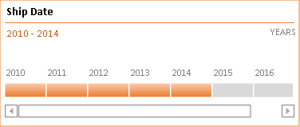

## **Possible Usage Scenarios**
Aspose.Cells supports the rendering of timeline shapes without requiring Office 2013, Office 2016, Office 2019, or Office 365. If you convert your worksheet into an image or you save your workbook to PDF or HTML formats, you will see that timelines are rendered properly.

## **Rendering Timeline**
The following sample code loads the [sample Excel file](input.xlsx) that contains an existing timeline. Get the shape object by the name of the timeline, and then render it into a picture through the `Shape.ToImage()` method. The following image is the [output image](out.png) that shows the rendered timeline. As you can see, the timeline has been rendered properly and it looks the same as in the sample Excel file.

### **Sample Code**



