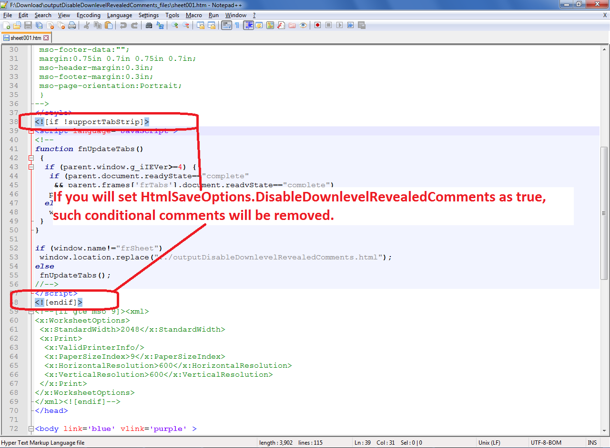

---  
title: Disable Downlevel Revealed Comments while saving to HTML  
type: docs  
weight: 20  
url: /net/disable-downlevel-revealed-comments-while-saving-to/  
ai_search_scope: cells_net  
ai_search_endpoint: "https://docsearch.api.aspose.cloud/ask"
---  

## **Possible Usage Scenarios**

When you save your Excel file to HTML, Aspose.Cells reveals downlevel conditional comments. These conditional comments are mostly relevant to older versions of Internet Explorer and are irrelevant to modern web browsers. You can read about them in detail at the following link.

- [Conditional comment - Downlevel-revealed conditional comment](https://en.wikipedia.org/wiki/Conditional_comment#Downlevel-revealed_conditional_comment)

Aspose.Cells allows you to eliminate these downlevel revealed comments by setting the **HtmlSaveOptions.DisableDownlevelRevealedComments** property to **true**.

## **Disable Downlevel Revealed Comments while saving to HTML**

The following sample code shows the usage of **HtmlSaveOptions.DisableDownlevelRevealedComments** property. The screenshot shows the effect of this property when it is not set to true. Please download the sample Excel file used in this code and the generated output HTML for reference.

## **Sample Code**

  

