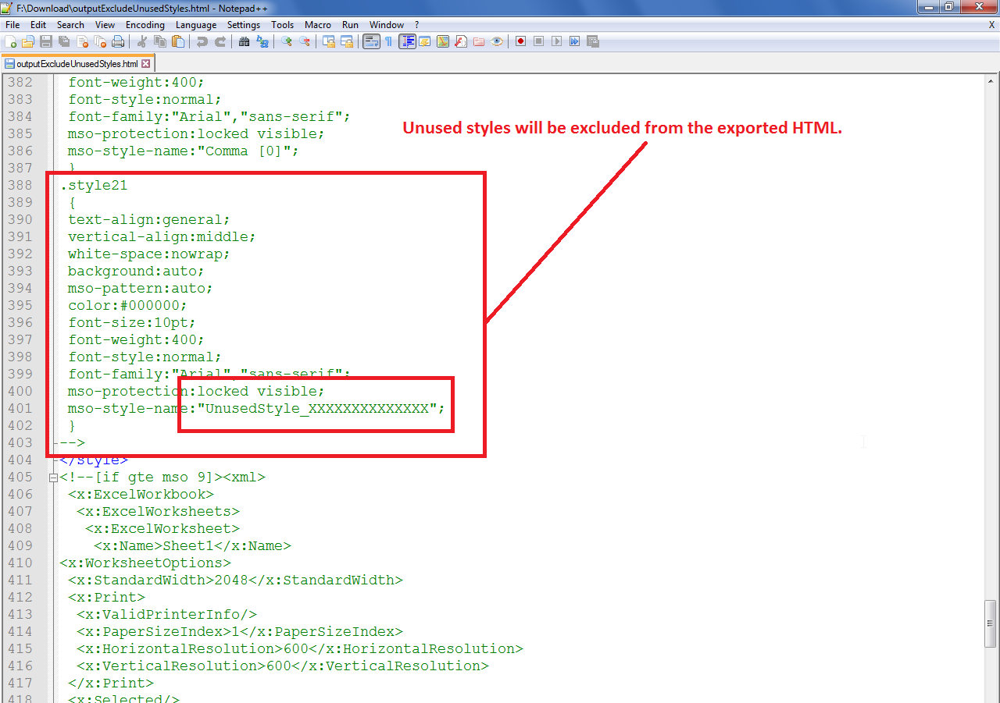

## **Possible Usage Scenarios**

Microsoft Excel file may contain many unused styles. When you export the Excel file to HTML format, these unused styles are also exported. This can increase the size of HTML. You can exclude the unused styles during the conversion of Excel file to HTML using the [**HtmlSaveOptions.ExcludeUnusedStyles**](https://reference.aspose.com/cells/net/aspose.cells/htmlsaveoptions/properties/excludeunusedstyles) property. When you set it **true**, all unused styles are excluded from output HTML. The following screenshot displays a sample unused style inside the output HTML.

## **Exclude Unused Styles during Excel to HTML conversion**

The following sample code creates a workbook and also creates an unused named style. Since the [**HtmlSaveOptions.ExcludeUnusedStyles**](https://reference.aspose.com/cells/net/aspose.cells/htmlsaveoptions/properties/excludeunusedstyles) is set to **true**, this unused named style will not be exported to [output HTML](61767778.zip). But if you set it to **false**, then this unused style will be present inside the output HTML which you can then see in HTML markup as shown in the above screenshot.

## **Sample Code**


