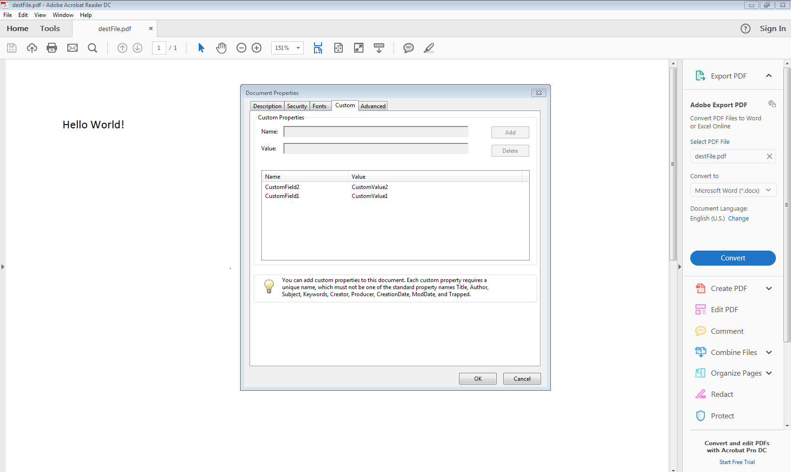

{}

Aspose.Cells supports conversion of Excel Workbook into PDF. In this example, we will see the complete conversion of an Excel Workbook into PDF.

{}

## **Converting Excel Workbook to PDF**

PDF files are widely used to exchange documents between organizations, government sectors, and individuals. It is a standard document format and software developers are often asked to find a way to convert Microsoft Excel files into PDF documents.

Aspose.Cells supports converting Excel files to PDF and maintains high visual fidelity in the conversion.

{}

Aspose.Cells for .NET directly writes the information about API and Version Number in output documents. For example, upon rendering Document to PDF, Aspose.Cells for .NET populates **PDF Producer** field with value, e.g 'Aspose.Cells v23.2'.

Please note that you can change this information in output Documents by **[PdfSaveOptions.Producer](https://reference.aspose.com/cells/net/aspose.cells/pdfsaveoptions/producer/)** property.

{}

### **Direct Conversion**

Aspose.Cells for .NET supports conversion from spreadsheets to PDF independently of other software. Simply save an Excel file to PDF using the **[Workbook](https://reference.aspose.com/cells/net/aspose.cells/workbook)** class' **[Save](https://reference.aspose.com/cells/net/aspose.cells/workbook/methods/save/index)** method. The **[Save](https://reference.aspose.com/cells/net/aspose.cells/workbook/methods/save/index)** method provides the **[SaveFormat.Pdf](https://reference.aspose.com/cells/net/aspose.cells/saveformat)** enumeration member that converts the native Excel files to PDF format.

Follow the below steps to directly convert the Excel spreadsheets to PDF format:

1. Instantiate an object of the **[Workbook](https://reference.aspose.com/cells/net/aspose.cells/workbook)** class by calling its empty constructor.
1. You may open/load an existing template file or skip this step if you are creating the workbook from scratch.
1. Do any work (input data, apply formatting, set formulas, insert pictures or other drawing objects, and so on) on the spreadsheet using Aspose.Cells' APIs.
1. When the spreadsheet code is complete, call the **[Workbook](https://reference.aspose.com/cells/net/aspose.cells/workbook)** class' **[Save](https://reference.aspose.com/cells/net/aspose.cells/workbook/methods/save/index)** method to save the spreadsheet.

The file format should be PDF so select *Pdf* (a pre-defined value) from the **[SaveFormat](https://reference.aspose.com/cells/net/aspose.cells/saveformat)** enumeration to generate the final PDF document.



### **Advanced Conversion**

You may also opt to use the **[PdfSaveOptions](https://reference.aspose.com/cells/net/aspose.cells/pdfsaveoptions)** class to set different attributes for the conversion. Setting different properties of the **[PdfSaveOptions](https://reference.aspose.com/cells/net/aspose.cells/pdfsaveoptions)** class gives you control over the print, font, security and compression settings for the output PDF. The most important property is **[Compliance](https://reference.aspose.com/cells/net/aspose.cells/pdfsaveoptions/properties/compliance)** which enables you to save the Excel files to PDF/A compliant PDF files.

#### **Saving Workbook to PDF/A Complied Files**

The below-provided code snippet demonstrates how to use the **[PdfSaveOptions](https://reference.aspose.com/cells/net/aspose.cells/pdfsaveoptions)** class to save Excel files to PDF/A compliant PDF format.



{}

Please note, the **[Compliance](https://reference.aspose.com/cells/net/aspose.cells/pdfsaveoptions/properties/compliance)** property was added with the release of Aspose.Cells for .NET 5.3.0.

{}

#### **Set the PDF Creation Time**

With the **[PdfSaveOptions](https://reference.aspose.com/cells/net/aspose.cells/pdfsaveoptions)** class, you can get or set the PDF creation time. The following code demonstrates the use of **[PdfSaveOptions.CreatedTime](https://reference.aspose.com/cells/net/aspose.cells/pdfsaveoptions/properties/createdtime)** property to set the creation time of the PDF file.



#### **Set ContentCopyForAccessibility option**

With the **[PdfSaveOptions](https://reference.aspose.com/cells/net/aspose.cells/pdfsaveoptions)** class, you can get or set the PDF **[AccessibilityExtractContent](https://reference.aspose.com/cells/net/aspose.cells.rendering.pdfsecurity/pdfsecurityoptions/properties/accessibilityextractcontent)** option to control the content access in the converted PDF.



#### **Export Custom properties to PDF**

With the **[PdfSaveOptions](https://reference.aspose.com/cells/net/aspose.cells/pdfsaveoptions)** class, you can export the custom properties in the source workbook to the PDF. **[PdfCustomPropertiesExport](https://reference.aspose.com/cells/net/aspose.cells.rendering/pdfcustompropertiesexport)** enumerator is provided for specifying the way by which properties are exported. These properties can be observed in Adobe Acrobat Reader by clicking on File and then properties option as shown in the following image. Template file "sourceWithCustProps.xlsx"  can be downloaded [here](sourceWithCustProps.xlsx) for testing and output PDF file "outSourceWithCustProps" is available [here](outSourceWithCustProps.pdf) for analysis.



### **Conversion Attributes**

We work to enhance the conversion features with each new release. Aspose.Cell's Excel to PDF conversion still has a couple of limitations. Some spreadsheet formatting might be lost when converting to PDF format. Also, some drawing objects are not yet supported.

The table that follows lists all features that are fully or partially supported when exporting to PDF using Aspose.Cells. This table is not final and does not cover all the spreadsheet attributes but it does identify those features that are not supported or partially supported for conversion to PDF.

|**Document Element**|**Attribute**|**Supported**|**Notes**|
| :- | :- | :- | :- |
|Alignment| |Yes| |
|Background settings| |Yes| |
|Border|Color|Yes| |
|Border|Line style|Yes| |
|Border|Line width|Yes| |
|Cell Data| |Yes| |
|Comments| |Yes| |
|Conditional Formatting| |Yes| |
|Document Properties| |Yes| |
|Drawing Objects| |Partially|Supported Objects: TextBox, Line, Rectangle, Oval, GroupBox, Button, CheckBox, RadioButton, ListBox, ComboBox, Label|
|Font|Size|Yes| |
|Font|Color|Yes| |
|Font|Style|Yes| |
|Font|Underline|Yes| |
|Font|Effects|Partially|Only strike through effect is supported|
|Images| |Yes| |
|Hyperlink| |Yes| |
|Charts| |Partially||
|Merged Cells| |Yes| |
|Page Break| |Yes| |
|Page Setup|Header/Footer|Yes| |
|Page Setup|Margins|Yes| |
|Page Setup|Page Orientation|Yes| |
|Page Setup|Page Size|Yes| |
|Page Setup|Print Area|Yes| |
|Page Setup|Print Titles|Yes| |
|Page Setup|Scaling|Yes| |
|Row Height/Column Width| |Yes| |
|RTL (Right to Left) Language| |Yes| |

{}

If your spreadsheet contains formulas, it is best to call **[Workbook.CalculateFormula()](https://reference.aspose.com/cells/net/aspose.cells/workbook/methods/calculateformula)** just before rendering the spreadsheet to PDF format. Doing so will ensure that the formula dependent values are recalculated, and the correct values are rendered in the PDF.

{}

## **Advance topics**
- [Add PDF Bookmarks](/cells/net/add-pdf-bookmarks/)
- [Add PDF Bookmarks with Named Destinations](/cells/net/add-pdf-bookmarks-with-named-destinations/)
- [Avoid Blank Page in Output PDF when there is Nothing to Print](/cells/net/avoid-blank-page-in-output-pdf-when-there-is-nothing-to-print/)
- [Change the Font on just the specific Unicode characters while saving to PDF](/cells/net/change-the-font-on-just-the-specific-unicode-characters-while-saving-to-pdf/)
- [Control loading of External Resources in MS Excel Workbook while rendering to PDF](/cells/net/control-loading-of-external-resources-in-ms-excel-workbook-while-rendering-to-pdf/)
- [Convert XLSX File to PDF Format](/cells/net/convert-xlsx-file-to-pdf-format/)
- [Convert Excel file to PDF format compatible with PDFA-1a](/cells/net/convert-excel-file-to-pdf-format-compatible-with-pdfa-1a/)
- [Convert XLS File with Images or Charts to PDF](/cells/net/convert-xls-file-with-images-or-charts-to-pdf/)
- [Create PdfBookmarkEntry for Chart Sheet](/cells/net/create-pdfbookmarkentry-for-chart-sheet/)
- [Fit All Worksheet Columns on Single PDF Page](/cells/net/fit-all-worksheet-columns-on-single-pdf-page/)
- [Get DrawObject and Bound while rendering to PDF using DrawObjectEventHandler class](/cells/net/get-drawobject-and-bound-while-rendering-to-pdf-using-drawobjecteventhandler-class/)
- [Get Warnings for Font Substitution while Rendering Excel File](/cells/net/get-warnings-for-font-substitution-while-rendering-excel-file/)
- [Ignore Errors while Rendering Excel to PDF](/cells/net/ignore-errors-while-rendering-excel-to-pdf/)
- [Limit the Number of Pages Generated - Excel to PDF Conversion](/cells/net/limit-the-number-of-pages-generated-excel-to-pdf-conversion/)
- [Print Comments while saving to PDF](/cells/net/print-comments-while-saving-to-pdf/)
- [Render Office Add-Ins while converting Excel to PDF](/cells/net/render-office-add-ins-while-converting-excel-to-pdf/)
- [Render One PDF Page Per Excel Worksheet - Excel to PDF Conversion](/cells/net/render-one-pdf-page-per-excel-worksheet-excel-to-pdf-conversion/)
- [Render Unicode Supplementary characters in output PDF by Aspose.Cells](/cells/net/render-unicode-supplementary-characters-in-output-pdf-by-aspose-cells/)
- [Resampling Added Images - Excel to PDF Conversion](/cells/net/resampling-added-images-excel-to-pdf-conversion/)
- [Save Each Worksheet to a Different PDF File](/cells/net/save-each-worksheet-to-a-different-pdf-file/)
- [Save Excel into PDF with Standard or Minimum Size](/cells/net/save-excel-into-pdf-with-standard-or-minimum-size/)
- [Save Specified Worksheets to PDF](/net/save-specified-worksheets-to-pdf/)
- [Secure PDF Documents](/cells/net/secure-pdf-documents/)
- [Specify how to cross string in output PDF and image](/cells/net/specify-how-to-cross-string-in-output-pdf-and-image/)
