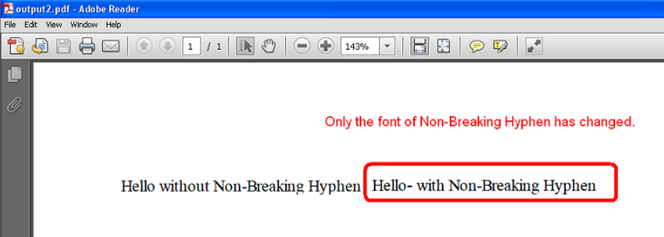

{}

Some Unicode characters are not displayable by the user‑specified font. One such Unicode character is **Non-breaking Hyphen** (U+2011) and its Unicode number is 8209. This character cannot be displayed with **Times New Roman**, but it can be displayed with other fonts like **Arial Unicode MS**.

When such a character occurs inside a word or sentence that is formatted with a specific font such as Times New Roman, Aspose.Cells changes the font of the entire word or sentence to a font that can display this character, such as Arial Unicode MS.

However, this behavior is undesirable for some users, who want only the specific character’s font to be changed instead of changing the font of the entire word or sentence.

To address this problem, Aspose.Cells provides the `PdfSaveOptions.IsFontSubstitutionCharGranularity` property, which should be set to **true** so that only the font of the specific character that is not displayable is changed to a displayable font, while the rest of the word or sentence remains in the original font.

{}

## **Example**
The following screenshot compares the two output PDFs generated by the sample code below.

One is generated without setting the `PdfSaveOptions.IsFontSubstitutionCharGranularity` property, and the other is generated after setting this property to **true**.

As you can see in the first PDF, the font of the entire sentence has changed from Times New Roman to Arial Unicode MS because of the Non‑Breaking Hyphen, whereas in the second PDF, only the font of the Non‑Breaking Hyphen has changed.

|**First PDF File**|
| :- |
||

|**Second PDF File**|
| :- |
||

### **Sample Code**




