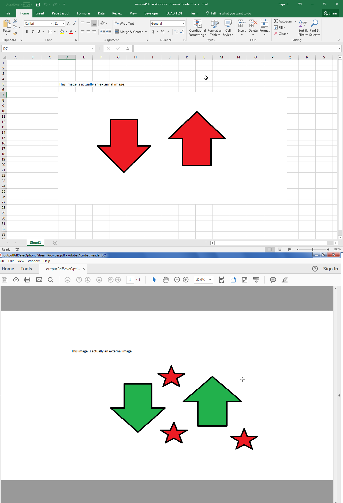

## **Possible Usage Scenarios**

Your Excel file may contain external resources, e.g., linked images or objects. When you convert your Excel file to PDF, Aspose.Cells retrieves these external resources and renders them to PDF. However, sometimes you do not want to load these external resources; moreover, you may want to manipulate them. You can do this using **WorkbookSettings.StreamProvider**, which implements the **IStreamProvider** interface.

## **Control Loading of External Resources in an MS Excel Workbook While Rendering to PDF**

The following sample code demonstrates how to use **WorkbookSettings.StreamProvider** to control the loading of external resources and manipulate them. Please refer to the sample Excel file (50528322.xlsx) used in the code and the output PDF (50528325.pdf) generated by the code. The screenshot shows how the old external image (50528324.png) in the sample Excel file was replaced with a new image (50528323.png) in the output PDF.

## **Sample Code**



