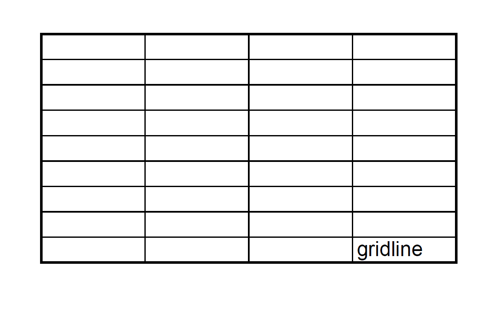

For compatibility with older versions, Aspose.Cells renders gridlines as dotted lines by default when converting Excel to PDF. However, modern Excel renders gridlines as solid lines nowadays.

With the option [PdfSaveOptions.GridlineTypes](https://reference.aspose.com/cells/net/aspose.cells/pdfsaveoptions/gridlinetype/), Aspose.Cells can also render gridlines as solid lines.




