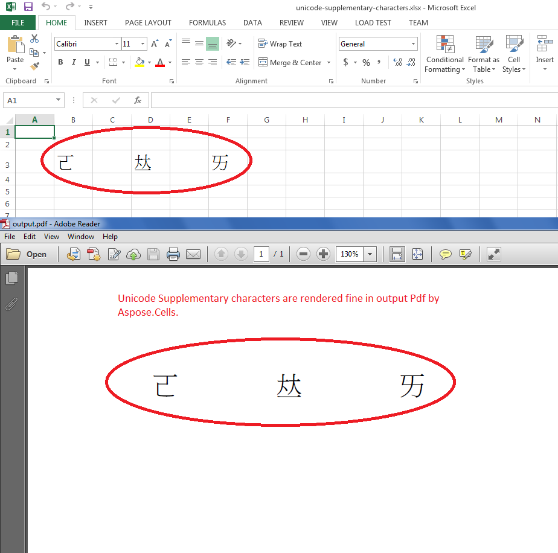

{}

Normal Unicode characters are 2-bytes long while Unicode Supplementary characters are 4-bytes long. Aspose.Cells now supports rendering of these 4-bytes Unicode characters.

In the Unicode Character Standard, Supplementary Characters are the characters assigned code points from U+10000 to U+10FFFF. In other words, these are the Unicode characters greater than U+FFFF.

- In UTF-8 these characters are each 4 bytes long.
- In UTF-16 these characters require 2 surrogates (16-bit units).

{}

## Render Unicode Supplementary characters in output PDF by Aspose.Cells

The following screenshot shows how Aspose.Cells rendered the [source excel file](5115563.xlsx) into the [output PDF](5115564.pdf). As you can see all three Unicode Supplementary characters have been rendered exactly same as done by Microsoft Excel.

## Sample Code

You can use this sample code to convert [source excel file](5115563.xlsx) into [output PDF](5115564.pdf).


