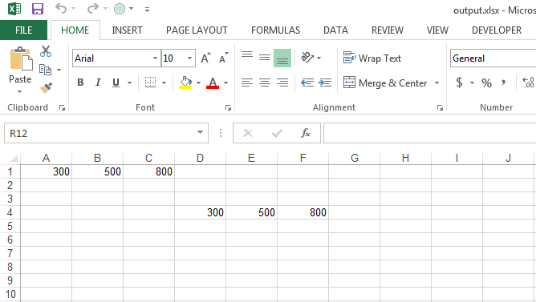

{}

CSV files mostly contain textual data and do not contain any formulas. However, sometimes it happens that CSV files also contain formulas. Such CSV files should be loaded by setting the [TxtLoadOptions.HasFormula](https://reference.aspose.com/cells/net/aspose.cells/txtloadoptions/properties/hasformula) as **true**. Once this property is set to **true**, Aspose.Cells will not treat the formula as simple text. They will be treated as formulas and Aspose.Cells' formula calculation engine will process them as usual.

{}

The following code illustrates how you can load as well as import a CSV file with formulas. You can use any CSV file. For illustration purposes, we use the simple CSV file (5115034.csv) which contains this data. As you see, it contains a formula.



300,500,=Sum(A1:B1)





The code first loads the CSV file, then imports it again at cell D4. Finally, it saves the workbook object in **XLSX** format. The [output XLSX file](5115052.xlsx) looks like this. As you see, cells C3 and F4 contain formulas and their result, 800.

||
| :- |


