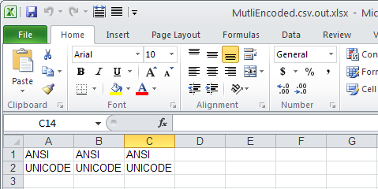

{}

Sometimes, your CSV file contains multiple Encodings (Unicode, ANSI, UTF8, UTF7, etc). Aspose.Cells allows you to load such CSV files and converting them into other formats, for example, PDF or XLSX.

{}

Aspose.Cells provides the [**TxtLoadOptions.IsMultiEncoded**](https://reference.aspose.com/cells/net/aspose.cells/txtloadoptions/properties/ismultiencoded) property, which you need to set to **true** to load your CSV file with multiple encodings properly.

The following screenshot shows a sample CSV file that contains two lines. The first line is in **ANSI** encoding and the second line is in **Unicode** encoding

|**Input file**|
| :- |
||

The following screenshot shows the XLSX file converted from the above CSV file without setting the [**TxtLoadOptions.IsMultiEncoded**](https://reference.aspose.com/cells/net/aspose.cells/txtloadoptions/properties/ismultiencoded) property to **true**. As you can see, the Unicode text was not converted properly.

|**Output file 1: no accommodation made for multiple encoding**|
| :- |
||

The following screenshot shows the XSLX file converted from the above CSV file after setting the [**TxtLoadOptions.IsMultiEncoded**](https://reference.aspose.com/cells/net/aspose.cells/txtloadoptions/properties/ismultiencoded) property to **true**. As you can see, the Unicode text is now converted properly.

|**Output file 2: IsMultiEncoded is set to true**|
| :- |
||

Below is the sample code that converts the above CSV file into XLSX format properly.



## Related Articles

- [Opening CSV Files](/cells/net/opening-files-with-different-formats/#opening-csv-files)

