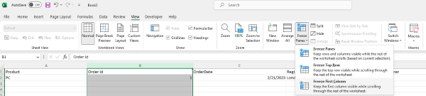

## **Introduction**

In this article, we will learn how to freeze left column(s). When you have a huge amount of data in a row, so you are unable to see the left columns when horizontally scrolled down the worksheet. You can freeze and lock first column(s) so that you can see that frozen portion even when the rest of the datas are being scrolled. You can easily see headers in the left columns.

## **Freeze Columns In Excel**

****

1. If you want to freeze left column(s), then first select the column under the column that needs to be frozen
2. Click View > Freeze Panes.
3. On the drop-down menu, click Freeze First column.
4. If you scroll down ,the first column is always in the left view.

****

As you can see 1st column is frozen, the fist column is always locked at the top of the view when you scroll horizontally.

Freeze Columns let you view your long data without any keeping track of the first column.

## **Freeze Columns with Aspose.Cells for .Net**
It's simple to freeze first column(s) with Aspose.Cells for .Net. 
Please use the [**Worksheet.FreezePanes**](https://reference.aspose.com/cells/net/aspose.cells/worksheet/freezepanes/) method to feeze column(s) at the selected column.
1. Construct Workbook to open the file or create an empty file.
2. Freeze the fist column with Worksheet.FreezePanes() method.
3. Save the file.



Attached [sample source Excel file](Freeze.xlsx).
