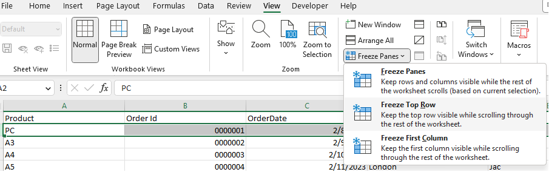

## **Introduction**

In this article, we will learn how to freeze top row(s). When you have a huge amount of data under a common heading, you are unable to see the heading when scrolled down the worksheet. You can freeze top row(s) so that you can see that frozen portion even when the rest of the data is being scrolled. You can easily see headers in the top rows.

## **Freeze Rows In Excel**

****

1. If you want to freeze top row(s), then first select the row below the row that needs to be frozen.  
2. Click **View > Freeze Panes**.  
3. On the drop‑down menu, click **Freeze Top Row**.  
4. If you scroll down, the first row is always in the top view.

****

As you can see, the first row is frozen; the first row always stays at the top of the view when you scroll down.

Freeze rows let you view your large data without having to keep track of row labels.

## **Freeze Rows with Aspose.Cells for .Net**

It's simple to freeze row(s) with Aspose.Cells for .Net.  
Please use the [**Worksheet.FreezePanes**](https://reference.aspose.com/cells/net/aspose.cells/worksheet/freezepanes/) method to freeze row(s) at the selected row.

1. Construct a [**Workbook**](https://reference.aspose.com/cells/net/aspose.cells/workbook) to open the file or create an empty file.  
2. Freeze the first row with the **Worksheet.FreezePanes()** method.  
3. Save the file.



Attached [sample source Excel file](../Freeze.xlsx).  

