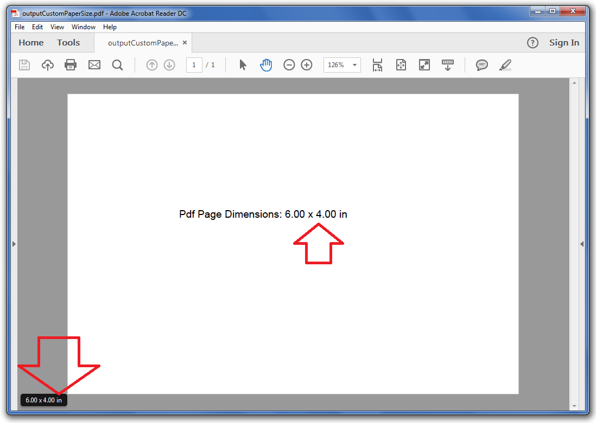

## **Possible Usage Scenarios**

There is no direct option available to create custom paper sizes in MS Excel; however, you can set the custom paper size for your desired worksheets when rendering an Excel file to PDF format. This document explains how to set a custom paper size for a worksheet using Aspose.Cells APIs.

## **Implement Custom Paper Size of Worksheet for Rendering**

Aspose.Cells allows you to set a custom paper size for a worksheet. You may use the [**CustomPaperSize**](https://reference.aspose.com/cells/net/aspose.cells/pagesetup/methods/custompapersize) method of the [**PageSetup**](https://reference.aspose.com/cells/net/aspose.cells/pagesetup) class to specify a custom page size. The following sample code illustrates how to specify a custom paper size for the first worksheet in the workbook. Please also see the [output PDF](45056028.pdf) generated with the following code for reference.

## **Screenshot**

## **Sample Code**



