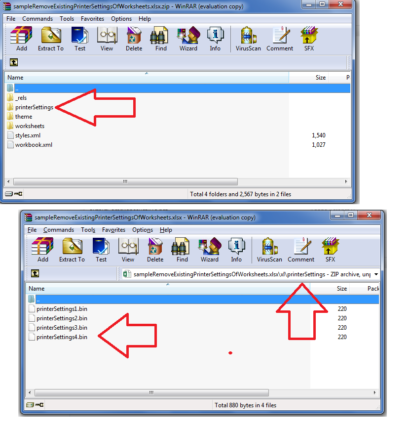

---  
title: Remove Existing PrinterSettings of Worksheets in Excel file  
type: docs  
weight: 60  
url: /net/remove-existing-printersettings-of-worksheets-in-excel-file/  
description: In this article, you will learn how to remove existing PrinterSettings of worksheets inside the Excel file through the PageSetup object programmatically with sample code using the C# API or .NET Library.  
keywords: remove printer settings of worksheet c#, remove printer settings of excel worksheet c#  
ai_search_scope: cells_net  
ai_search_endpoint: "https://docsearch.api.aspose.cloud/ask"
---  

## **Possible Usage Scenarios**  
Sometimes developers want to prevent Excel from including *.bin* files of printer settings in the saved XLSX files. Printer settings files are located under *“[file "root"]\xl\printerSettings”.* This document explains how to remove existing printer settings using Aspose.Cells APIs.  

## **Remove Existing PrinterSettings of Worksheets in Excel file**  
Aspose.Cells allows you to remove existing printer settings specified for different sheets in the Excel file. The following sample code illustrates how to remove existing printer settings for all the worksheets in the workbook. Please see its [sample Excel file](45056020.xlsx), [output Excel file](45056021.xlsx), console output as well as the screenshot for reference.  

## **Screenshot**  
  

## **Sample Code**  
  

## **Console Output**  
  

PrinterSettings of this worksheet exists.  

Sheet Name: Sheet1  

Paper Size: PaperLegal  

Printer settings of this worksheet are now removed by setting it to null.  

PrinterSettings of this worksheet exists.  

Sheet Name: Sheet2  

Paper Size: PaperEnvelopeB5  

Printer settings of this worksheet are now removed by setting it to null.  

PrinterSettings of this worksheet exists.  

Sheet Name: Sheet3  

Paper Size: PaperA6  

Printer settings of this worksheet are now removed by setting it to null.  

PrinterSettings of this worksheet exists.  

Sheet Name: Sheet4  

Paper Size: PaperA3  

Printer settings of this worksheet are now removed by setting it to null.  

  

