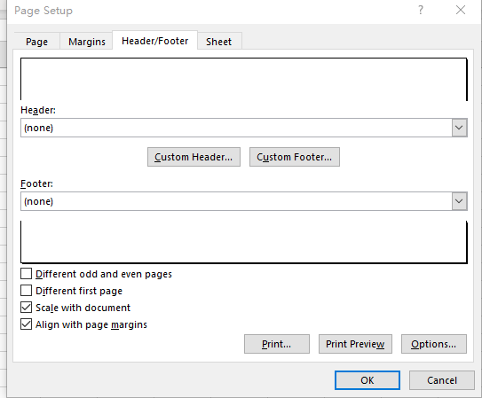

{}

MS Excel supports setting different headers and footers for the first page, odd pages and even pages since Excel 2007.
Aspose.Cells supports the same feature.

{}

## **Setting Different Headers and Footers in MS Excel**

****

1. Click **page Layout > Print Titles > Header/Footer**.
1. Check **Different Odd and Even Pages** or **Different fir page**.
1. Enter different headers and footers.

## **Setting Different Headers and Footers with Aspose.Cells**

Aspose.Cells behaves the same as Excel.
1. Sets the flags [PageSetup.IsHFDiffOddEven](https://reference.aspose.com/cells/net/aspose.cells/pagesetup/ishfdiffoddeven/) and [PageSetup.IsHFDiffFirst](https://reference.aspose.com/cells/net/aspose.cells/pagesetup/IsHFDiffFirst/) 
1. Enter different headers and footers.


