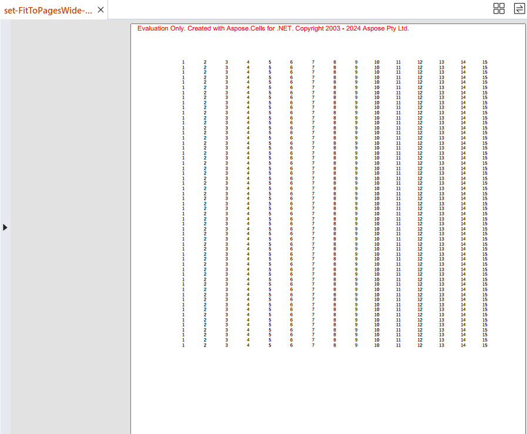

## **Introduction**

The FitToPagesWide and FitToPagesTall settings are used in spreadsheet applications (like Microsoft Excel) to control how a spreadsheet is scaled when printing. These settings help ensure that your printed output fits within a specified number of pages, both horizontally and vertically. Here's a breakdown of each setting:

1. **FitToPagesWide**: This setting specifies the number of pages wide that the printed output should fit into. For example, setting FitToPagesWide to 1 means the content will be scaled to fit within a single page width, no matter how wide the spreadsheet is.  
2. **FitToPagesTall**: This setting specifies the number of pages tall that the printed output should fit into. For example, setting FitToPagesTall to 1 means the content will be scaled to fit within a single page height, regardless of the number of rows.

## **Why Use FitToPagesWide and FitToPagesTall**
Here are some reasons to set FitToPagesWide and FitToPagesTall:

1. **Control Over Printed Layout**: By specifying the number of pages wide and tall, you can ensure that your printed document is easy to read and well‑organized, without any columns or rows being split awkwardly across pages.  
2. **Consistency**: If you're printing multiple sheets or reports, using these settings helps maintain a consistent format, making it easier to compare and analyze printed documents.  
3. **Professional Presentation**: Properly scaling and fitting content to a specified number of pages can result in a more professional and polished presentation of your data.

## **How to Print File as Fitted Pages Wide and Tall in Excel**

To set the FitToPagesWide and FitToPagesTall settings in Microsoft Excel, follow these steps:

1. Open your Excel workbook and go to the sheet you want to print.  
2. Go to the **Page Layout** tab on the Ribbon.  
3. In the **Page Setup** group, click the small arrow in the bottom‑right corner to open the Page Setup dialog box.  
4. In the Page Setup dialog box, go to the **Page** tab.  
5. Under **Scaling**, select the option **Fit to** and then specify the number of pages wide and tall you want:  
   * Enter the number of pages wide you want in the first box (Fit to x pages wide).  
   * Enter the number of pages tall you want in the second box (Fit to y pages tall).  

 

6. Click **OK** to apply the settings.

## **How to Print Excel as Fitted Pages Wide and Tall Using Aspose.Cells**

To set FitToPagesWide and FitToPagesTall in a specific worksheet, first load the [sample file](input.xlsx), then modify the  
[**Worksheet.PageSetup.FitToPagesTall**](https://reference.aspose.com/cells/net/aspose.cells/pagesetup/fittopagestall/) and  
[**Worksheet.PageSetup.FitToPagesWide**](https://reference.aspose.com/cells/net/aspose.cells/pagesetup/fittopageswide/) properties of the [**PageSetup**](https://reference.aspose.com/cells/net/aspose.cells/pagesetup/) object for the desired worksheet. Here is an example in C#:



The output:

 

## **How to Print Worksheet as One Page Using Aspose.Cells**

To print a worksheet as one page, first load the [sample file](sample.xlsx), then set the [**PdfSaveOptions.OnePagePerSheet**](https://reference.aspose.com/cells/net/aspose.cells/paginatedsaveoptions/onepagepersheet/) property of the [**PdfSaveOptions**](https://reference.aspose.com/cells/net/aspose.cells/pdfsaveoptions/) object. Here is an example in C#:



The output:

 

## **How to Print All Columns of Worksheet in One Page Using Aspose.Cells**

To print all columns of a worksheet on one page, first load the [sample file](sample.xlsx), then set the [**PdfSaveOptions.AllColumnsInOnePagePerSheet**](https://reference.aspose.com/cells/net/aspose.cells/paginatedsaveoptions/allcolumnsinonepagepersheet/) property of the [**PdfSaveOptions**](https://reference.aspose.com/cells/net/aspose.cells/pdfsaveoptions/) object. Here is an example in C#:



The output:

 


