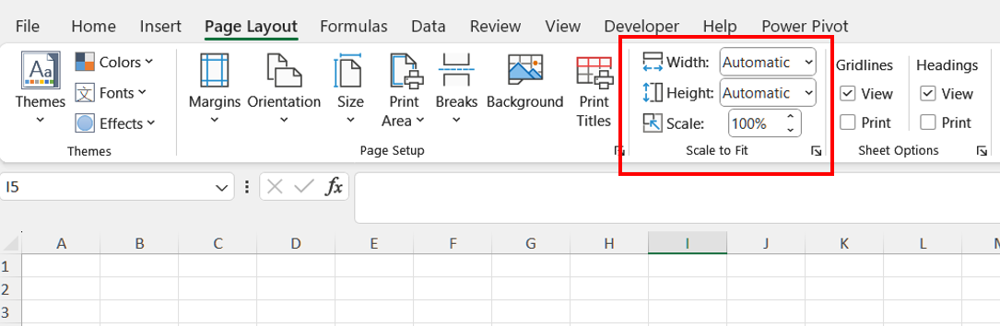

## **Possible Usage Scenarios**
Scaling a worksheet can be useful for various reasons, depending on the context in which you are working. Here are a few common reasons for scaling a worksheet:
1. Fit to Page: To ensure that all the content fits on a single page or a specific number of pages when printing, making it easier to read and manage without having to flip through multiple pages.

1. Presentation: To make the worksheet look more organized and professional, particularly when sharing it with others in meetings or reports.

1. Readability: To adjust the size of the text and other elements for better readability, especially for people who may have difficulty reading smaller fonts.

1. Space Management: To optimize the use of space on a worksheet, ensuring that there is no unnecessary white space and that all important information is visible without excessive scrolling.

1. Data Visualization: In the case of charts and graphs, scaling can help in making them more comprehensible by adjusting the size to fit the available space appropriately.

1. Consistency: To maintain a consistent look and feel across multiple worksheets or documents, which is particularly important in professional and educational settings.

## **How to Scale a Worksheet in Excel**
Scaling a worksheet in Excel can help you fit your content onto a single page or a specified number of pages when printing. Here are the steps to scale a worksheet:

1. Open Your Worksheet: Open the Excel worksheet that you want to scale.

1. Go to the Page Layout Tab: Click on the Page Layout tab in the Ribbon.

1. Scale to Fit Group: In the Page Layout tab, find the Scale to Fit group. Here you have options to adjust the scaling. Width: This option allows you to specify how many pages wide the printed worksheet will be. Height: This option allows you to specify how many pages tall the printed worksheet will be. Scale: You can also set a custom scaling percentage here.
 

1. Adjust Width and Height: Set the Width and Height to your desired number of pages. For example, set both to 1 page if you want the worksheet to fit on one page.

1. Adjust Scaling Percentage (if needed): If you prefer to set a specific scaling percentage, adjust the Scale box. For instance, setting it to 50% will make everything half the size.

## **How to Scale a Worksheet Using C#**
Aspose.Cells is a powerful library for working with Excel files programmatically. To scale a worksheet using Aspose.Cells, you need to follow these steps: load [sample file](sample.xlsx) and adjust the print settings so that the content fits to the desired number of pages or a specific percentage of the original size.

### **Example: Fit to Page**

 

### **Example: Scale to Percentage**

 

