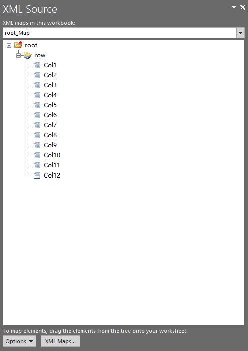

## **Possible Usage Scenarios**

Aspose.Cells provides the [**XmlMapCollection.Add()**](https://reference.aspose.com/cells/net/aspose.cells/xmlmapcollection/methods/add) method, which you can use to import an XML map into the workbook.

## **Add XML Map inside the Workbook using XmlMapCollection.Add method**

The following sample code adds an XML map into the workbook using the [**XmlMapCollection.Add()**](https://reference.aspose.com/cells/net/aspose.cells/xmlmapcollection/methods/add) method and saves it as an [output Excel file](5115434.xlsx). The screenshot shows the XML map that has been imported from the [sample.xml](5115433.xml) into the output Excel file.



