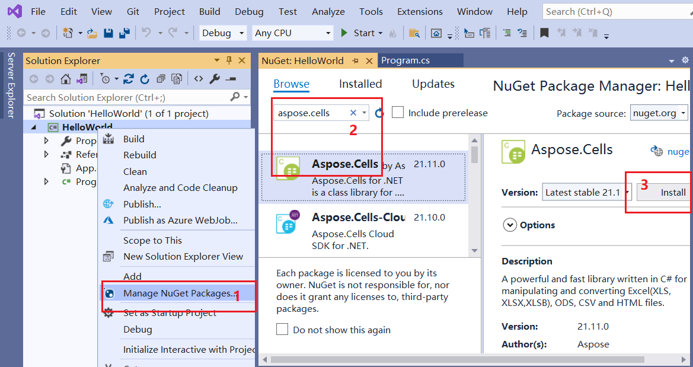
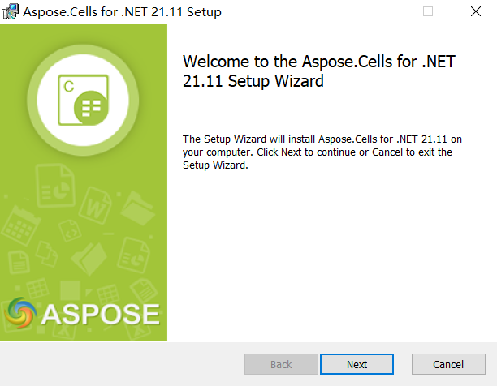
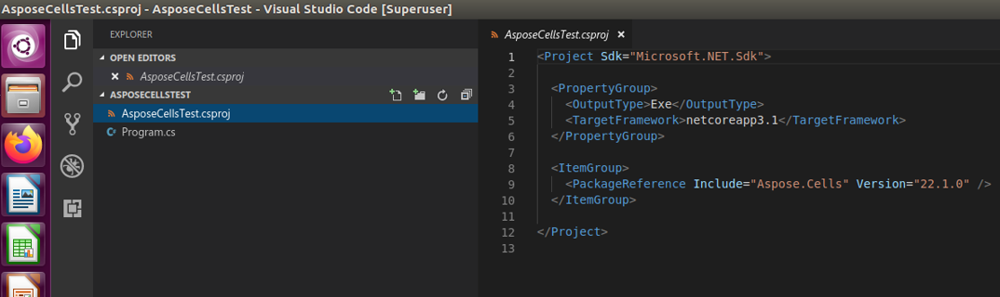
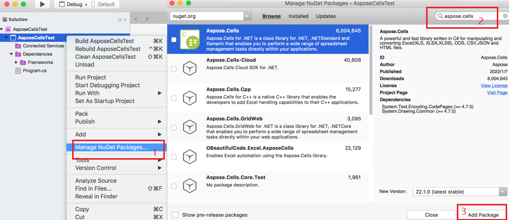

{} 

This page will show you how to install Aspose Cells, and create a Hello World application.

{}

## **Installation**

### **Install Aspose.Cells through NuGet**

NuGet is the easiest way to download and install Aspose.Cells for .NET. 

1. Open Microsoft Visual Studio and NuGet package manager. 
1. Search "aspose.cells" to find the desired Aspose.Cells for .NET. 
1. Click on "Install", Aspose.Cells for .NET will be downloaded and referenced in your project.
****

You can also download it from the nuget web page for aspose.cells: 
[Aspose.Cells for .NET NuGet Package](https://www.nuget.org/packages/Aspose.Cells/)

[More step for details](/cells/net/installation/)

### **Install Aspose.Cells on windows**

1. Download Aspose.Cells.msi from the following page:
[Download Aspose.Cells.msi](https://downloads.aspose.com/cells/net/)
1. Double-click the Aspose Cells msi and follow the instructions to install it:

****

[More step for details](/cells/net/installing-aspose-cells-on-windows/)

### **Install Aspose.Cells on linux**

In this example, I use Ubuntu to show how to start using Aspose.Cells on linux.

1. Create a .netcore application, named "AsposeCellsTest".
2. Open file "AsposeCellsTest.csproj", add the following lines into it for Aspose.Cells package references:

  <ItemGroup>
    <PackageReference Include="Aspose.Cells" Version="24.3" />
  </ItemGroup>

3. Open the project with VSCode on Ubuntu:
****
4. run test with the following code:


Note: Aspose.Cells For .NetStandard can support your requirement on linux.

Applies to: NetStandard2.0, NetCore2.1, NetCore3.1, Net5.0, Net6.0 and advanced version.

### **Install Aspose.Cells on MAC OS**

In this example, I use macOS High Sierra to show how to start using Aspose.Cells on MAC OS.

1. Create a .netcore application, named "AsposeCellsTest".
2. Open the application with Visual Studio for Mac, then install Aspose Cells through NuGet:
****
3. run test with the following code:

4. If you need to use drawing-related features, please install libgdiplus in macOS, see:
[How to Install libgdiplus in macOS](/cells/net/how-to-install-libgdiplus-in-macos/)

Note: Aspose.Cells For .NetStandard can support your requirement on MAC OS.

Applies to: NetStandard2.0, NetCore2.1, NetCore3.1, Net5.0, Net6.0 and advanced version.

### **[Run Aspose Cells in Docker](/cells/net/how-to-run-aspose-cells-in-docker/)**

### **How to use graphics library on non-windows platforms with Net6**

Aspose.Cells for Net6 now uses SkiaSharp as the graphics library, as recommended in [official statement of Microsoft](https://github.com/dotnet/designs/blob/f9d006073b7a019bd2021e99c66516447f7fb1a6/accepted/2021/system-drawing-win-only/system-drawing-win-only.md). For more details about using Aspose.Cells with NET6, please see [How to Run Aspose.Cells for .Net6](/cells/net/how-to-run-aspose-cells-for-net6/).

## **Creating the Hello World Application**

The steps below creates the Hello World application using the Aspose.Cells API:

1. If you have a license, then [apply it](/cells/net/licensing/).
   If you are using the evaluation version, skip the license related code lines.
1. Create an instance of the [Workbook](https://reference.aspose.com/cells/net/aspose.cells/workbook) class to create a new Excel file, or open an existing Excel file.
1. Access any desired cell of a worksheet in the Excel file.
1. Insert the words **Hello World!** into a cell accessed.
1. Generate the modified Microsoft Excel file.

The implementation of the above steps is demonstrated in the examples below.

### **Code Sample: Creating a New Workbook**

The following example creates a new workbook from the scratch, inserts "Hello World!" into cell A1 in the first worksheet and saves as Excel file.



### **Code Sample: Opening an Existing File**

The following example opens an existing Microsoft Excel template file "Sample.xlsx", inserts "Hello World!" into cell A1 in the first worksheet and saves as Excel file.


