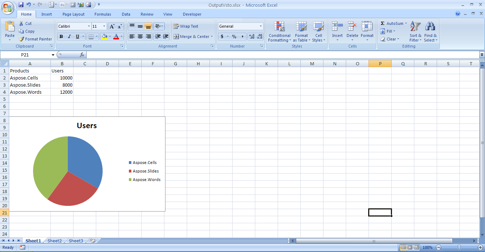
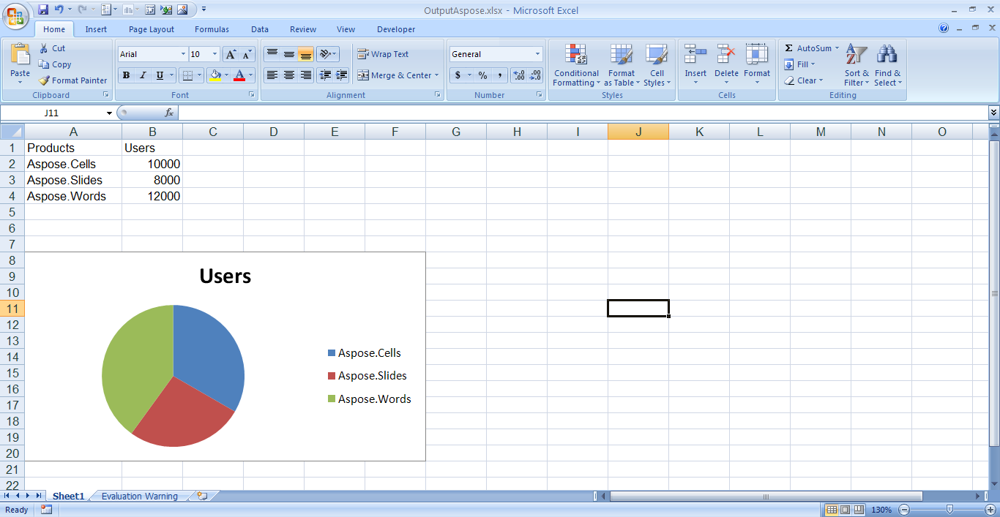

{}

Charts present data in an easy-to-understand way. Users who work with Microsoft Excel can create a number of different charts and customize them. The same features are available for developers who work with Aspose.Cells for .NET.

{}

## **Creating a Pie Chart**

This article compares how to create a pie chart using Office Automation and VSTO with using Aspose.Cells for .NET. The steps for creating a pie chart are:

1. Creating a workbook and worksheet.  
2. Adding sample data.  
3. Referencing `productsChart`.  
4. Adding a pie chart, defining the data range and chart title.  
5. Saving the spreadsheet.

The code samples in this article show how to add a pie chart with [VSTO](/cells/net/create-a-pie-chart/), using either C# or Visual Basic, compared to creating one with [Aspose.Cells](/cells/net/create-a-pie-chart/), again using either C# or Visual Basic.

### **Creating a Pie Chart with VSTO**

The code samples that follow show how to add a pie chart to a spreadsheet using VSTO.

**C#**



 void PieChart()
{
    // Access a VSTO worksheet
    Microsoft.Office.Tools.Excel.Worksheet sheet = this;

    // Add sample data for the pie chart
    // Add headings in A1 and B1
    sheet.Cells[1, 1] = "Products";
    sheet.Cells[1, 2] = "Users";

    // Add data from A2 to B4
    sheet.Cells[2, 1] = "Aspose.Cells";
    sheet.Cells[2, 2] = 10000;
    sheet.Cells[3, 1] = "Aspose.Slides";
    sheet.Cells[3, 2] = 8000;
    sheet.Cells[4, 1] = "Aspose.Words";
    sheet.Cells[4, 2] = 12000;

    // Chart reference
    Microsoft.Office.Tools.Excel.Chart productsChart;

    // Add a pie chart
    productsChart = sheet.Controls.AddChart(0, 105, 330, 200, "ProductUsers");
    productsChart.ChartType = Microsoft.Office.Interop.Excel.XlChartType.xlPie;

    // Set chart title
    productsChart.HasTitle = true;
    productsChart.ChartTitle.Text = "Users";

    // Get the cells that define the data to be charted
    Microsoft.Office.Interop.Excel.Range chartRange = sheet.get_Range("A2", "B4");
    productsChart.SetSourceData(chartRange, missing);

    // Access the active workbook from the VSTO sheet
    Microsoft.Office.Interop.Excel.Workbook workbook = sheet.Application.ActiveWorkbook;

    // Save the copy of the workbook as OutputVsto.xlsx
    workbook.SaveCopyAs("C:\\Downloads\\OutputVsto.xlsx");
}



**A pie chart created with VSTO** 

### **Creating a Pie Chart with Aspose.Cells for .NET**

The code samples that follow show how to add a pie chart to a spreadsheet using Aspose.Cells.

**C#**



 private void PieChart()
{
    // Create an Aspose.Cells workbook
    Workbook workbook = new Workbook();

    // Access the Aspose.Cells worksheet
    Worksheet sheet = workbook.Worksheets[0];

    // Add sample data for the pie chart
    // Add headings in A1 and B1
    sheet.Cells["A1"].PutValue("Products");
    sheet.Cells["B1"].PutValue("Users");

    // Add data from A2 to B4
    sheet.Cells["A2"].PutValue("Aspose.Cells");
    sheet.Cells["B2"].PutValue(10000);
    sheet.Cells["A3"].PutValue("Aspose.Slides");
    sheet.Cells["B3"].PutValue(8000);
    sheet.Cells["A4"].PutValue("Aspose.Words");
    sheet.Cells["B4"].PutValue(12000);

    // Chart reference
    Chart productsChart;

    // Add a pie chart
    int chartIdx = sheet.Charts.Add(ChartType.Pie, 7, 0, 20, 6);
    productsChart = sheet.Charts[chartIdx];

    // Get the cells that define the data to be charted
    int seriesIdx = productsChart.NSeries.Add("=Sheet1!$B$2:$B$4", true);
    Series nSeries = productsChart.NSeries[seriesIdx];
    nSeries.XValues = "=Sheet1!$A$2:$A$4";

    // Set chart title
    productsChart.Title.Text = "Users";

    // Autofit the first column
    sheet.AutoFitColumn(0);

    // Save the workbook as OutputAspose.xlsx
    workbook.Save("C:\\Downloads\\OutputAspose.xlsx");
}



**Pie chart created with Aspose.Cells for .NET** 


