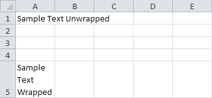
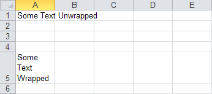

{}

Wrapping text makes it easier to read: a cell with wrapped text expands to fit the text so that the text isn't displayed over other cells.

With Aspose.Cells for .NET, developers can perform most of the tasks in their applications that users can perform with Microsoft Excel, including wrapping text in cells. This article explains how, and compares the task using VSTO and Aspose.Cells. Aspose.Cells is optimized for efficient coding and works without Microsoft Automation.

{}

## **Wrapping Cell Text**

To create a worksheet with two cells, one with wrapped text and one without:

1. Set up the worksheet:
   1. Create a workbook.
   1. Access the first worksheet.
1. Add text:
   1. Add text to cell A1.
   1. Add wrapped text to cell A5.
1. Save the spreadsheet.

The code samples below show how to perform these steps using [VSTO](/cells/net/wrapping-cell-text/) with either C# or Visual Basic. Code samples that show how to do the same thing using [Aspose.Cells for .NET](/cells/net/wrapping-cell-text/), again using either C# or Visual Basic follow immediately after.

Running the code results in a spreadsheet with two cells, one that has text that hasn't been wrapped, and one that has:

|
**Output wrapping cell text with VSTO** 

|
**Output wrapping cell text with Aspose.Cells for .NET** 

|
| :- | :- |

### **Wrapping Cell Text Using VSTO**

**C#**



 //Note: To help you better, the code uses full namespacing

void WrappingCellText()

{

    //Access vsto application

    Microsoft.Office.Interop.Excel.Application app = Globals.ThisAddIn.Application;

    //Access workbook 

    Microsoft.Office.Interop.Excel.Workbook workbook = app.ActiveWorkbook;

    //Access worksheet 

    Microsoft.Office.Interop.Excel.Worksheet m_sheet = workbook.Worksheets[1];

    //Access vsto worksheet

    Microsoft.Office.Tools.Excel.Worksheet sheet = Globals.Factory.GetVstoObject(m_sheet);

    //Place some text in cell A1 without wrapping

    Microsoft.Office.Interop.Excel.Range cellA1 = sheet.Cells.get_Range("A1");

    cellA1.Value = "Sample Text Unwrapped";

    //Place some text in cell A5 with wrapping

    Microsoft.Office.Interop.Excel.Range cellA5 = sheet.Cells.get_Range("A5");

    cellA5.Value = "Sample Text Wrapped";

    cellA5.WrapText = true;

    //Save the workbook

    workbook.SaveAs("f:\\downloads\\OutputVsto.xlsx");

    //Quit the application

    app.Quit();

}



### **Wrapping Cell Text Using Aspose.Cells for .NET**

**C#**



 void WrappingCellText()

{

    //Create workbook

    Workbook workbook = new Workbook();

    //Access worksheet

    Worksheet worksheet = workbook.Worksheets[0];

    //Place some text in cell A1 without wrapping

    Cell cellA1 = worksheet.Cells["A1"];

    cellA1.PutValue("Some Text Unwrapped");

    //Place some text in cell A5 wrapping

    Cell cellA5 = worksheet.Cells["A5"];

    cellA5.PutValue("Some Text Wrapped");

    Style style = cellA5.GetStyle();

    style.IsTextWrapped = true;

    cellA5.SetStyle(style);

    //Autofit rows

    worksheet.AutoFitRows();

    //Save the workbook

    workbook.Save("f:\\downloads\\OutputAspose.xlsx", SaveFormat.Xlsx);

}



