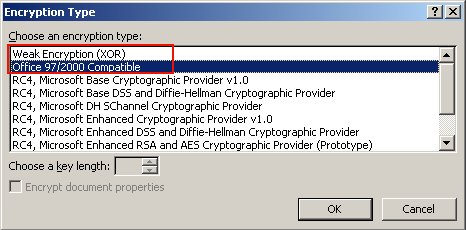

{} 

Microsoft Excel (97 - 2007) enables you to encrypt and password protect your spreadsheets. It uses algorithms provided by a cryptographic service provider, or CSP, a set of cryptographic algorithms with different properties. The default CSP is 'Office 97/2000 Compatible' or 'Weak Encryption (XOR)'. It's important to choose the proper encryption key length. Some CSPs don't support more than 40 or 56 bits. That's considered to be a weak encryption. For strong encryption, a minimum key length of 128 bits is required. Microsoft Windows contains CSPs that offer strong encryption types as well, for example the 'Microsoft Strong Cryptographic Provider'. To give you an idea, 128‑bit encryption is what banks use to encrypt the connection with their Internet Banking systems.

Aspose.Cells allows you to encrypt and password protect Microsoft Excel files with your desired encryption type.

{} 
## **Using Microsoft Excel**
To set file encryption settings in Microsoft Excel (here Microsoft Excel 2003):

1. From the **Tools** menu, select **Options**.  
   A dialog appears.  
2. Select the **Security** tab.  
3. Enter a password and click **Advanced**.  

   **Options dialog**  

   

4. Choose the encryption type and confirm the password.  

   **Encryption Type dialog**  

   

## **Encryption with Aspose.Cells**
The following example shows how to encrypt and password protect an Excel file using the Aspose.Cells API.

**C#**



 string FilePath = @"..\..\..\Sample Files\";

string srcFileName = FilePath + "Encrypting Excel Files.xlsx";

string destFileName = FilePath + "Result Encrypting Excel Files.xlsx";

// Open an Excel file.

Workbook workbook = new Workbook(srcFileName);

// Specify XOR encryption type.

workbook.SetEncryptionOptions(EncryptionType.XOR, 40);

// Specify Strong Encryption type (RC4, Microsoft Strong Cryptographic Provider).

workbook.SetEncryptionOptions(EncryptionType.StrongCryptographicProvider, 128);

// Password protect the file.

workbook.Settings.Password = "1234";

// Save the Excel file.

workbook.Save(destFileName);


## **Download Running Code**
- [Github](https://github.com/aspose-cells/Aspose.Cells-for-.NET/releases/tag/MissingFeaturesOpenXMLExcelv1.1)
## **Download Sample Code**
- [Github](https://github.com/aspose-cells/Aspose.Cells-for-.NET/tree/master/Plugins/Aspose.Cells%20Vs%20OpenXML%20Spreadsheets/OpenXML%20Missing%20Features/Encrypting%20Excel%20Files)


