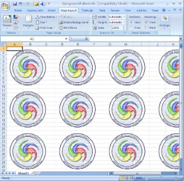

To apply a background image to a spreadsheet:

1. Create a workbook and access the sheet you want to apply a background image to.  
2. Apply the background image.  
3. Save the workbook.

The code samples that follow show how to do this first with VSTO, using either C# or Visual Basic, and then with Aspose.Cells for .NET, again using either C# or Visual Basic.

The code examples in this article create a worksheet with a repeating background image, like the one in the screenshot below.

A background has been set for the worksheet.

## **VSTO**



 //Instantiate the Application object.

Excel.Application ExcelApp = Application;

//Add a Workbook.

Excel.Workbook objBook = ExcelApp.Workbooks.Add(System.Reflection.Missing.Value);

//Get the first sheet.

Excel.Worksheet objSheet = (Excel.Worksheet)objBook.Sheets["Sheet1"];

//Set a background picture for the sheet.

objSheet.SetBackgroundPicture("pic.jpeg");

//Save the Excel file.

objBook.SaveCopyAs("BackgroundPicBook.xls");

//Quit the Application.

ExcelApp.Quit();



## **Aspose.Cells**



 //Instantiate a new Workbook.

Workbook workbook = new Workbook();

//Get the first worksheet.

Worksheet sheet = workbook.Worksheets[0];

//Define a string variable to store the image path.

string ImageUrl = "pic.jpeg";

//Get the picture into a stream.

FileStream fs = File.OpenRead(ImageUrl);

//Define a byte array.

byte[] imageData = new Byte[fs.Length];

//Obtain the picture into the byte array from the stream.

fs.Read(imageData, 0, imageData.Length);

//Close the stream.

fs.Close();

//Set the background image for the sheet.

sheet.SetBackground(imageData);

//Save the Excel file.

workbook.Save("BackgroundPicBook.xls");



## **Download Sample Code**

- [Github](https://github.com/asposemarketplace/Aspose_for_VSTO/releases/download/Aspose.Cells1.1/Set.Background.Picture.of.a.Worksheet.Aspose.Cells.zip)
- [Sourceforge](https://sourceforge.net/projects/asposevsto/files/Aspose.Cells%20Vs%20VSTO%20Excel/Set%20Background%20Picture%20of%20a%20Worksheet%20\(Aspose.Cells\).zip/download)
- [Bitbucket](https://bitbucket.org/asposemarketplace/aspose-for-vsto/downloads/Set%20Background%20Picture%20of%20a%20Worksheet%20\(Aspose.Cells\).zip)

