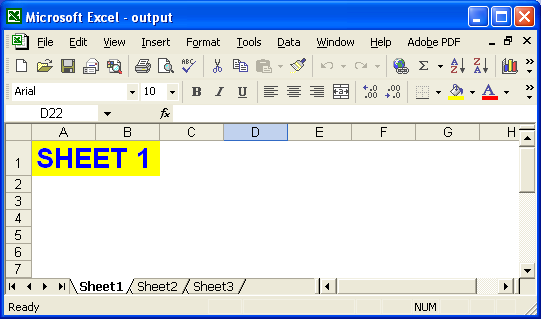

{}

All Excel worksheets have gridlines by default. They help delineate cells, so that it is easy to enter data into particular cells. Gridlines enable us to view a worksheet as a collection of cells, where each cell is easily identifiable.

{}

## **Controlling the Visibility of the Gridlines**

Aspose.Cells provides a class, [**Workbook**](https://reference.aspose.com/cells/net/aspose.cells/workbook), that represents a Microsoft Excel file. The [**Workbook**](https://reference.aspose.com/cells/net/aspose.cells/workbook) class contains a [**Worksheets**](https://reference.aspose.com/cells/net/aspose.cells/workbook/properties/worksheets) collection that allows access to each worksheet in the Excel file.

A worksheet is represented by the [**Worksheet**](https://reference.aspose.com/cells/net/aspose.cells/worksheet) class. The [**Worksheet**](https://reference.aspose.com/cells/net/aspose.cells/worksheet) class provides a wide range of properties and methods for managing a worksheet. To control the visibility of gridlines, use the [**Worksheet**](https://reference.aspose.com/cells/net/aspose.cells/worksheet) class' [**IsGridlinesVisible**](https://reference.aspose.com/cells/net/aspose.cells/worksheet/properties/isgridlinesvisible) property. [**IsGridlinesVisible**](https://reference.aspose.com/cells/net/aspose.cells/worksheet/properties/isgridlinesvisible) is a Boolean property, which means that it can only store a **true** or **false** value.

A complete example is given below that demonstrates the use of the [**IsGridlinesVisible**](https://reference.aspose.com/cells/net/aspose.cells/worksheet/properties/isgridlinesvisible) property of the [**Worksheet**](https://reference.aspose.com/cells/net/aspose.cells/worksheet) class to hide the gridlines of the first worksheet of the Excel file.

In the screenshot below, you can see that the Book1.xls file contains three worksheets: Sheet1, Sheet2 and Sheet3. All worksheets have gridlines.

**Book1.xls: worksheet view before modification** 

The Book1.xls file is opened by using the Workbook class and the gridlines on the first worksheet are hidden. The modified file is saved as output.xls.

**Output.xls: worksheet after modification** 

**C#**



 //Creating a file stream containing the Excel file to be opened

FileStream fstream = new FileStream("book1.xls", FileMode.Open);

//Instantiating a Workbook object

//Opening the Excel file through the file stream

Workbook workbook = new Workbook(fstream);

//Accessing the first worksheet in the Excel file

Worksheet worksheet = workbook.Worksheets[0];

//Hiding the gridlines of the first worksheet of the Excel file

worksheet.IsGridlinesVisible = false;

//Saving the modified Excel file

workbook.Save("output.xls");

//Closing the file stream to free all resources

fstream.Close();



## **Download Running Code**

- [GitHub](https://github.com/aspose-cells/Aspose.Cells-for-.NET/tree/master/Plugins/Aspose.Cells%20Vs%20VSTO%20Spreadsheets/Aspose.Cells%20Features%20missing%20in%20VSTO/Display%20or%20Hide%20Gridlines)

## **Download Sample Code**

- [GitHub](https://github.com/aspose-cells/Aspose.Cells-for-.NET/releases/tag/MissingFeaturesAsposeCellsForVSTO1.1)
