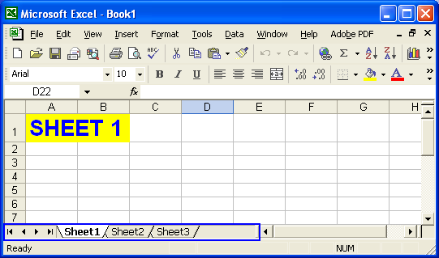

{} 

If you closely look at the bottom of a Microsoft Excel file, you will see a number of controls. These include:

- Sheet tabs.
- Tab scrolling buttons.

Sheet tabs represent the worksheets in the Excel file. Click any tab to switch to that worksheet. The more worksheets in the workbook, the more sheet tabs there are. If the Excel file has a good number of worksheets you need buttons to navigate through them. So, Microsoft Excel provides tab scrolling buttons for scrolling through the sheet tabs.

**Sheet tabs & tab scrolling buttons** 

Using Aspose.Cells, developers can control the visibility of sheet tabs and tabs scrolling buttons in Excel files. 

{} 

Below is a complete example that opens an Excel file (book1.xls), hides its tabs and saves the modified file as output.xls.

You can see that Book1.xls file contains tabs in the figure below. After the example code is executed, the tabs are hidden, as you can see from the screenshot of the output.xls file below.

**book1.xls: Excel file before any modification** 

**output.xls: Excel file after modification** 

**C#**



 //Instantiating a Workbook object

//Opening the Excel file

Workbook workbook = new Workbook("book1.xls");

//Hiding the tabs of the Excel file

workbook.Settings.ShowTabs = false;

//Saving the modified Excel file

workbook.Save("output.xls");


## **Controlling the Tab Bar Width**
**C#**



 //Adjusting the sheet tab bar width

workbook.Worksheets.SheetTabBarWidth = 800;


## **Download Running Code**
- [GitHub](https://github.com/aspose-cells/Aspose.Cells-for-.NET/tree/master/Plugins/Aspose.Cells%20Vs%20VSTO%20Spreadsheets/Aspose.Cells%20Features%20missing%20in%20VSTO/Display%20or%20Hide%20Tabs)
## **Download Sample Code**
- [GitHub](https://github.com/aspose-cells/Aspose.Cells-for-.NET/releases/tag/MissingFeaturesAsposeCellsForVSTO1.1)

