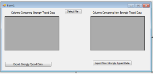
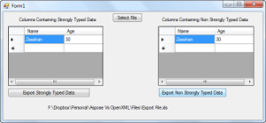

If all values in the columns of a worksheet are not strongly typed (that means the values in a column may have the different data types) then we can export the worksheet content by calling the **ExportDataTableAsString** method of the Cells class. **ExportDataTableAsString** method takes the same set of parameters as that of **ExportDataTable** method to export worksheet data as **DataTable** object.



 //Creating a file stream containing the Excel file to be opened

FileStream fstream = new FileStream(FOD_OpenFile.FileName, FileMode.Open);

//Instantiating a Workbook object

//Opening the Excel file through the file stream

Workbook workbook = new Workbook(fstream);

//Accessing the first worksheet in the Excel file

Worksheet worksheet = workbook.Worksheets[0];

//Exporting the contents of 2 rows and 2 columns starting from 1st cell to DataTable

DataTable dataTable = worksheet.Cells.ExportDataTableAsString(0, 0, 2, 2, true);

//Binding the DataTable with DataGrid

dataGridView2.DataSource = dataTable;

//Closing the file stream to free all resources

fstream.Close();



Below are the screenshots:

## **Download Sample Code**

- [Github](https://github.com/asposemarketplace/Aspose_for_VSTO/releases/download/Cells1.0/Export.from.Worksheet.Aspose.Cells.zip)
- [Bitbucket](https://bitbucket.org/asposemarketplace/aspose-for-openxml/downloads/Export%20from%20Worksheet%20%28Aspose.Cells%29.zip)

