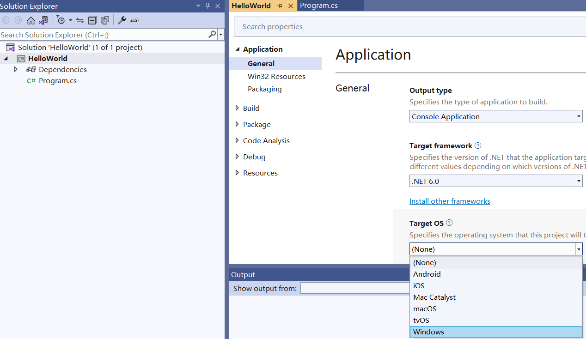

## Overview

For the .NET 6 (or later) platforms, compared to previous platforms (.NET Core 3.1 or earlier), an important difference concerns the graphics library.  
In this official [Microsoft documentation](https://learn.microsoft.com/en-gb/dotnet/core/compatibility/core-libraries/6.0/system-drawing-common-windows-only), it explains that for .NET 6 or later releases the graphics library **System.Drawing.Common** will be supported only on Windows and gives recommendations to replace the graphics library.

**Note:** For **Aspose.Cells** product, we have conducted the evaluation and have completed the migration of the graphics library. We use **SkiaSharp** instead of **System.Drawing.Common** on non‑Windows systems, as suggested in Microsoft's official documentation. Please note that this critical change will take effect in Aspose.Cells 22.10.1 or later for .NET 6.

For .NET Core 3.1 or earlier, for compatibility and stability, we still use the **System.Drawing.Common** graphics library. The dependencies for .NET Core 3.1 or earlier are as follows:

- System.Drawing.Common, 5.0.3.
- System.Security.Cryptography.Pkcs, 6.0.5.
- System.Text.Encoding.CodePages, 4.7.0.

## Run Aspose.Cells for .NET 6 (or greater) on Windows

First, create a .NET 6 (or greater) application with VS2022, then choose one of the following installation options:

### Install through NuGet

1. Search for Aspose.Cells on NuGet: [Aspose.Cells for .NET NuGet Package](https://www.nuget.org/packages/Aspose.Cells/).  
   You can also install Aspose.Cells from the NuGet package manager in VS2022.

2. **SkiaSharp** or **System.Drawing.Common** will be installed automatically as a dependency of Aspose.Cells 22.10.1 or later for .NET 6 (or greater) platforms, depending on the **Target OS** configuration in your project.  
   - Set the **Target OS** to **Windows** for your project; you will use **System.Drawing.Common** as a dependency on your Windows system for a .NET 6 (or greater) project. In this configuration, the drawing result is closer to .NET Core 3.1 or earlier.  
     ****
   - Set the **Target OS** to **None** or another option for your project; you will use **SkiaSharp** as a dependency on your Windows system for a .NET 6 (or greater) project. *Please note the version that uses **SkiaSharp** as a dependency does not support the printing‑to‑printer feature.*

### Install through MSI or DLL

1. [Download Aspose.Cells MSI or DLL](https://releases.aspose.com/cells/net/)

2. Open the installation directory or the DLL directory, then select step 3 or 4 below:

3. Locate the **net6.0-windows** subdirectory, add the **Aspose.Cells.dll** in it to your .NET 6 application, and manually add the following NuGet packages to your .NET 6 project:  
   - System.Drawing.Common, 6.0.0.  
   - System.Security.Cryptography.Pkcs, 6.0.5.  
   - System.Text.Encoding.CodePages, 4.7.0.

   In this way, you will use **System.Drawing.Common** as a dependency on your Windows system for a .NET 6 (or greater) project. The drawing result is closer to .NET Core 3.1 or earlier.

4. Locate the **net6.0** subdirectory, add the **Aspose.Cells.dll** in it to your .NET 6 application, and manually add the following NuGet packages to your .NET 6 project:  
   - SkiaSharp, 3.116.1.  
   - System.Security.Cryptography.Pkcs, 6.0.5.  
   - System.Text.Encoding.CodePages, 4.7.0.

   In this way, you will use **SkiaSharp** as a dependency on your Windows system for a .NET 6 (or greater) project. *Please note the version that uses **SkiaSharp** as a dependency does not support the printing‑to‑printer feature.*

## Run Aspose.Cells for .NET 6 (or greater) on Linux

Refer to the installation method on Windows; you can select **SkiaSharp** as the graphics library dependency on a Linux system.

You need to perform the following additional operations to ensure proper use of SkiaSharp under Linux:

1. Run the following command on your Linux system:  

   ```bash
   apt-get update && apt-get install -y libfontconfig1
   ```

   **OR**

   ```bash
   apk update && apk add fontconfig
   ```

2. Add the NuGet package **SkiaSharp.NativeAssets.Linux 3.116.1** to your .NET 6 (or greater) project.

3. Or you can choose to add the NuGet package **SkiaSharp.NativeAssets.Linux.NoDependencies 3.116.1** to your .NET 6 (or greater) project, instead of the two steps above.

*Please note, the version of the added package **SkiaSharp.NativeAssets.Linux** or **SkiaSharp.NativeAssets.Linux.NoDependencies** should correspond to the version of **SkiaSharp** referenced by Aspose.Cells for .NET. The versions of Aspose.Cells for .NET and the corresponding referenced **SkiaSharp** versions are described as follows:*

| Aspose.Cells for .NET | SkiaSharp |
|:----------------------:|:----------:|
| >= 22.10.1 && <= 22.11 | 2.88.0 |
| >= 22.12 && <= 23.9   | 2.88.3 |
| >= 23.10 && <= 24.12  | 2.88.6 |
| = 25.1.1              | 3.116.1 |
| >= 25.1.2             | 2.88.9 (.NET 6.0, .NET 8.0), 3.116.1 (.NET 9.0) |

### Example Dockerfile for Ubuntu

1. Add the NuGet package **SkiaSharp.NativeAssets.Linux 3.116.1** to your .NET 6 (or greater) project.

2. Use the following Dockerfile:


# Ubuntu 20.04
FROM mcr.microsoft.com/dotnet/runtime:6.0-focal AS base
WORKDIR /app

# Add "libfontconfig1" package if using "SkiaSharp.NativeAssets.Linux" in your project
# Or use "SkiaSharp.NativeAssets.Linux.NoDependencies" in your project
RUN apt-get update && apt-get install -y libfontconfig1

# Copy fonts from local to Docker
# For example, place a "fonts" folder in your project folder and put the font files in it,
# then use the following line:
COPY fonts/ /usr/share/fonts

FROM mcr.microsoft.com/dotnet/sdk:6.0-focal AS build
WORKDIR /src
COPY ["Ubuntu_Docker.csproj", "."]
RUN dotnet restore "./Ubuntu_Docker.csproj"
COPY . .
WORKDIR "/src/."
RUN dotnet build "Ubuntu_Docker.csproj" -c Release -o /app/build

FROM build AS publish
RUN dotnet publish "Ubuntu_Docker.csproj" -c Release -o /app/publish

FROM base AS final
WORKDIR /app
COPY --from=publish /app/publish .
ENTRYPOINT ["dotnet", "Ubuntu_Docker.dll"]


### Example Dockerfile for Alpine

1. Add the NuGet package **SkiaSharp.NativeAssets.Linux 3.116.1** to your .NET 6 (or greater) project.

2. Use the following Dockerfile:


# Alpine 3.16
FROM mcr.microsoft.com/dotnet/runtime:6.0-alpine3.16 AS base
WORKDIR /app

# Add "fontconfig" package if using "SkiaSharp.NativeAssets.Linux" in your project
# Or use "SkiaSharp.NativeAssets.Linux.NoDependencies" in your project
RUN apk update && apk add fontconfig

# Copy fonts from local to Docker
# For example, place a "fonts" folder in your project folder and put the font files in it,
# then use the following line:
COPY fonts/ /usr/share/fonts

FROM mcr.microsoft.com/dotnet/sdk:6.0-alpine3.16 AS build
WORKDIR /src
COPY ["Alpine_Docker.csproj", "."]
RUN dotnet restore "./Alpine_Docker.csproj"
COPY . .
WORKDIR "/src/."
RUN dotnet build "Alpine_Docker.csproj" -c Release -o /app/build

FROM build AS publish
RUN dotnet publish "Alpine_Docker.csproj" -c Release -o /app/publish

FROM base AS final
WORKDIR /app
COPY --from=publish /app/publish .
ENTRYPOINT ["dotnet", "Alpine_Docker.dll"]

