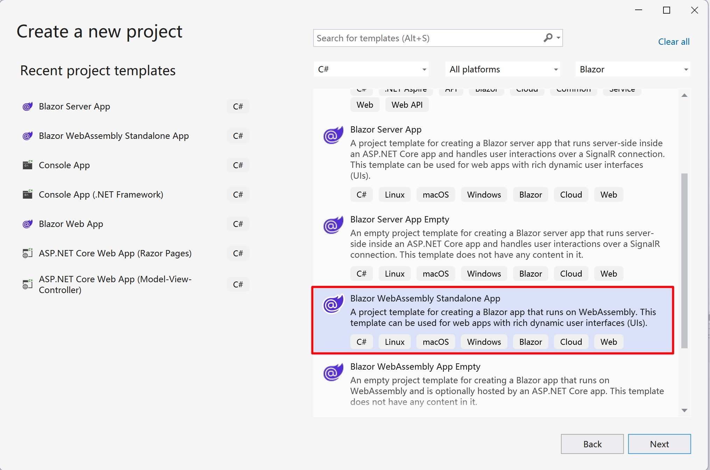
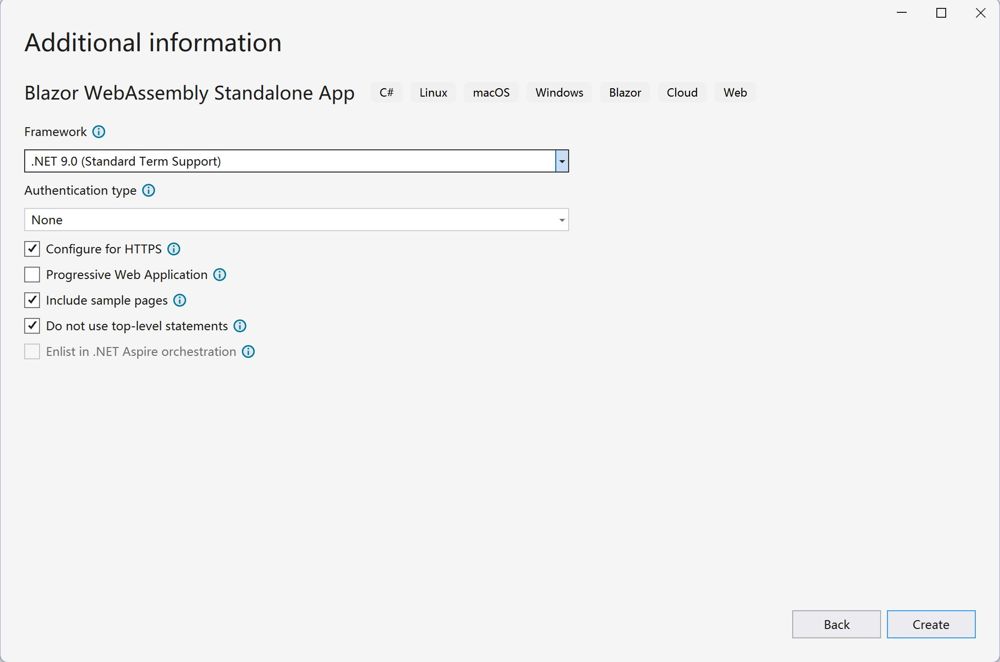
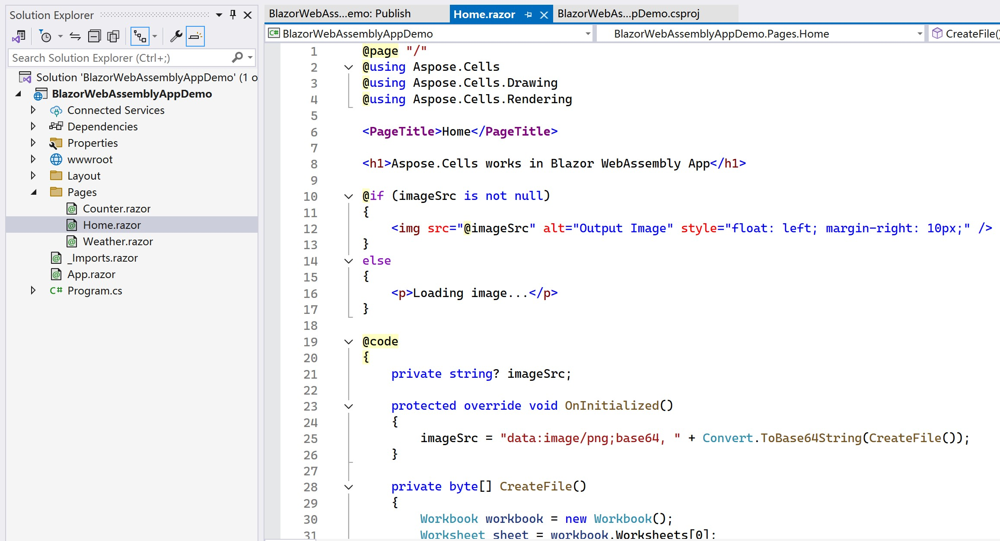
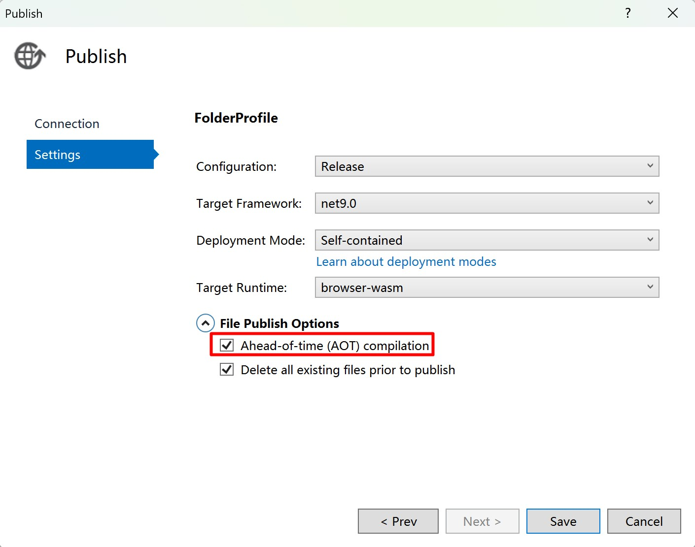
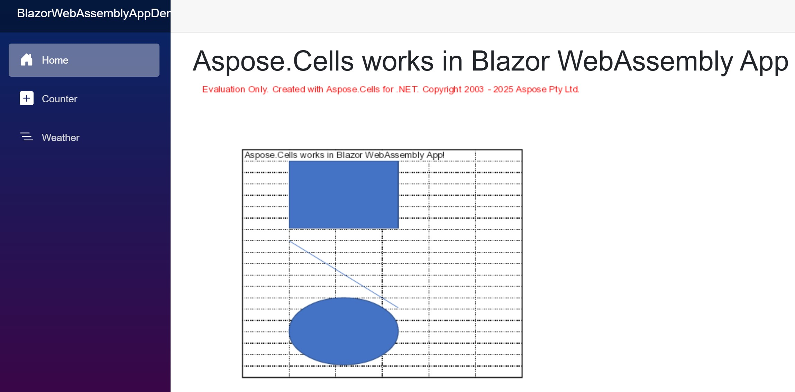
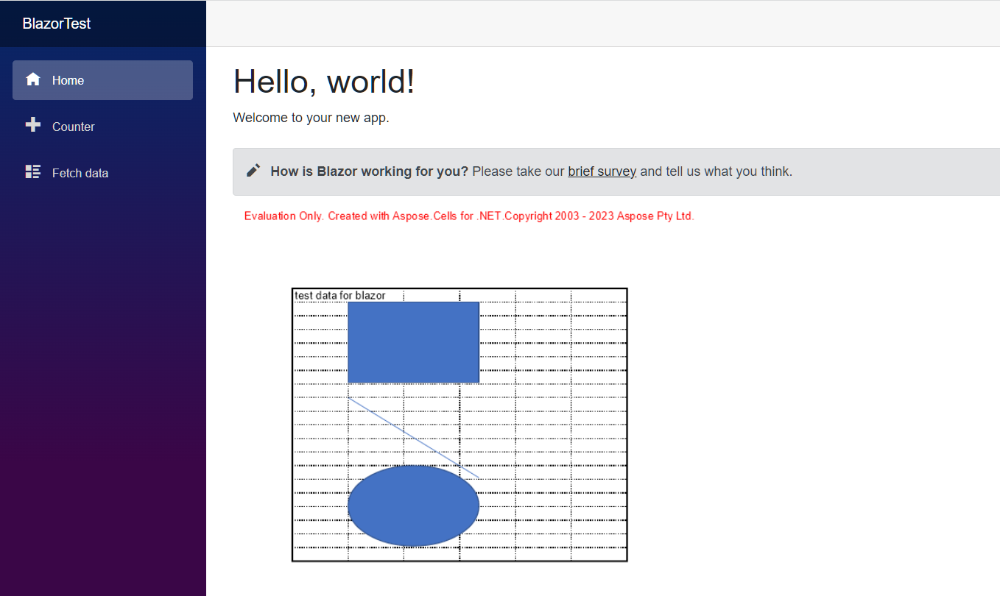

## Overview

Blazor is a web framework developed by Microsoft that allows developers to build interactive, client-side web applications using C# and .NET instead of JavaScript. Blazor comes in two primary hosting models: **Blazor WebAssembly** and **Blazor Server**. You can use **Aspose.Cells for .NET** directly in both models.

## Blazor WebAssembly Application with Aspose.Cells

Blazor WebAssembly runs client-side in the browser using WebAssembly. It allows developers to run .NET applications directly in the browser without relying on a server for rendering. From **Aspose.Cells for .NET 25.1**, Aspose.Cells can be used in Blazor WebAssembly App directly. In this example, you will create a simple Blazor WebAssembly with Aspose.Cells, render an Excel file with text and shapes into a png image, then display the image on a page.

### Create Blazor WebAssembly Application

Let's use the VS2022 tool as an example to create the first Blazor WebAssembly App with Aspose.Cells, follow the steps below:

1. Create a new project with **Blazor WebAssembly Standalone App** template.

   

2. Choose target framework, recommended .NET 8.0 or above.

   

3. After the project is created, add Aspose.Cells package to the project. Because Aspose.Cells references SkiaSharp, to make SkiaSharp work in WebAssembly, the "SkiaSharp.Views.Blazor" package is needed.

   ```
   <PackageReference Include="Aspose.Cells" Version="25.1.1" />
   <PackageReference Include="SkiaSharp.Views.Blazor" Version="3.116.1" />
   ```

   *Please note, the version of the added package "SkiaSharp.Views.Blazor" should be corresponding to the version of "SkiaSharp" referenced by Aspose.Cells for .NET. The versions of Aspose.Cells for .NET and the corresponding referenced "SKiaSharp" versions are described as following:*

   | Aspose.Cells for .NET |                SkiaSharp                |
   | :-------------------: | :-------------------------------------: |
   |       = 25.1.1        |                 3.116.1                 |
   |       >=25.1.2        | 2.88.9(net6.0, net8.0), 3.116.1(net9.0) |

4. Navigate to "Home.razor" file in "Pages" folder in the project, write code to add some data and shapes, and render into an image for display.

   

5. Right click the project and choose "Publish...", then publish the project to folder with or without AOT option.

   

6. After publishing, the output files will be located in the `publish/wwwroot` folder. These files are static files (HTML, JS, CSS, etc.), so they can be hosted using:

   - **Local Web Server** (e.g., `dotnet serve`, `nginx`, or `Apache`).
   - **Cloud Hosting** (e.g., Azure, AWS, Netlify, GitHub Pages).

   Let's take `dotnet serve` for example:

   - Install the `dotnet-serve` tool (if not already installed):

     ```bash
     dotnet tool install -g dotnet-serve
     ```

   - Navigate to the published `wwwroot` directory.

   - Start the server:

     ```bash
     dotnet serve
     ```

7. Open your browser and visit the address displayed (e.g., `http://localhost:1970`), the output image will be displayed on the page.

   

### Sample Code in Blazor WebAssembly Application

The following sample code is included in the Home.razor file:

```cs
@page "/"
@using Aspose.Cells
@using Aspose.Cells.Drawing
@using Aspose.Cells.Rendering

<PageTitle>Home</PageTitle>

<h1>Aspose.Cells works in Blazor WebAssembly App</h1>

@if (imageSrc is not null)
{
    
}
else
{
    <p>Loading image...</p>
}

@code
{
    private string? imageSrc;

    protected override void OnInitialized()
    {
        imageSrc = "data:image/png;base64, " + Convert.ToBase64String(CreateFile());
    }

    private byte[] CreateFile()
    {
        Workbook workbook = new Workbook();
        Worksheet sheet = workbook.Worksheets[0];
        sheet.Cells["A1"].Value = "Aspose.Cells works in Blazor WebAssembly App!";

        sheet.PageSetup.PrintGridlines = true;
        sheet.PageSetup.PrintArea = "A1:F20";

        ShapeCollection shapes = sheet.Shapes;

        //Add rectangle shape
        shapes.AddRectangle(1, 0, 1, 0, 100, 150);

        //Add line shape
        shapes.AddLine(8, 0, 1, 0, 100, 150);

        //Add oval shape
        shapes.AddOval(13, 0, 1, 0, 100, 150);

        using MemoryStream ms = new();

        SheetRender render = new SheetRender(sheet, new ImageOrPrintOptions());
        render.ToImage(0, ms);

        return ms.ToArray();
    }
}
```

### Trouble Shot

Currently(Jan 2025) there is a known issue of `dotnet` in the case that publishing a Blazor WebAssembly project which targets to net8.0 with .NET 9.0 SDK(.NET 9.0 SDK is installed and .NET 8.0 SDK is uninstalled if you upgraded Visual Studio to the version v17.12.x). For more info, check the link: <https://github.com/dotnet/runtime/issues/109951>.

```
System.PlatformNotSupportedException: PlatformNotSupported_HybridGlobalization, HashCode
   at System.Globalization.CompareInfo.GetHashCodeOfStringCore(ReadOnlySpan`1 , CompareOptions )
   at System.Globalization.CompareInfo.GetHashCode(ReadOnlySpan`1 , CompareOptions )
   at System.Globalization.CompareInfo.GetHashCode(String , CompareOptions )
   at System.CultureAwareComparer.GetHashCode(String )
   at System.StringComparer.GetHashCode(Object )
```

If this is your case, there are three options to choose:

1. Reinstall .NET 8.0 SDK(if it was uninstalled) and use a "global.json" file at solution level(same folder as .sln file) to specify the SDK used. Here is an example of "global.json" file:

   ```
   {
     "sdk": {
       "version": "8.0.300",
       "rollForward": "latestFeature"
     }
   }
   ```

   

2. Update the project file to target net9.0.

3. Update Visual Studio to the version v17.12.4.(The issue <https://github.com/dotnet/runtime/issues/109951> is fixed.(updated on Jan 15, 2025))

## Blazor Server Application with Aspose.Cells

In this example, you will create a simple Blazor Server App that adds some data and graphics, and render them into images to display on the webpage. During the project creation process, you can configure options according to your own needs. For example, when you check the "Enable Docker" option, the blazor application can then be built and run in Docker..

### Create Blazor Server Application

Let's use the VS2022 tool as an example to create the first Blazor Server App with Aspose.Cells, follow the steps below:
1. Select File ->New ->Project and filter using the blazer keyword to select the corresponding project template.
<br>

1. Set the project name to "BlazorTest" and select the path.
<br>

1. Configure the libraries and other options used in the project. Finally, click the "Create" button to generate your first blazer project.
<br>

1. After entering the project, click the "Dependencies" under the project and select the "Manage NuGet Packages..." to add the Aspose.Cells library.
<br>

1. Enter keywords for filtering and install the latest Aspose.Cells library. Simultaneously dependent libraries such as SkiaSharp will also be installed together.
<br>

1. Double click on the "Index.razor" file to edit and import the required library. Add some data and graphics, and render them into graphics for display.
<br>

1. Compile and run the project, and you will get the following results.
<br>


### Sample Code in Blazor Sever Application

The following sample code is included in the Index.razor file:
```
@page "/"
@using SkiaSharp;
@using Aspose.Cells;
@using Aspose.Cells.Drawing;
@using Aspose.Cells.Rendering;


<PageTitle>Index</PageTitle>

<h1>Hello, world!</h1>

Welcome to your new app.

<SurveyPrompt Title="How is Blazor working for you?" />


@code
{
    private string imageSrc;

    public Index()
    {
        imageSrc = "data:image/png;base64, " + Convert.ToBase64String(CreateFile());
    }

    private byte[] CreateFile()
    {
        Workbook workbook = new Workbook();
        Worksheet sheet = workbook.Worksheets[0];
        sheet.Cells["A1"].Value = "test data for blazor";

        sheet.PageSetup.PrintGridlines = true;
        sheet.PageSetup.PrintArea = "A1:F20";

        ShapeCollection shapes = sheet.Shapes;

        //Add rectangle shape
        shapes.AddRectangle(1, 0, 1, 0, 100, 150);

        //Add line shape
        shapes.AddLine(8, 0, 1, 0, 100, 150);

        //Add oval shape
        shapes.AddOval(13, 0, 1, 0, 100, 150);

        using MemoryStream ms = new();

        SheetRender render = new SheetRender(sheet, new ImageOrPrintOptions());
        render.ToImage(0, ms);

        return ms.ToArray();
    }
}

```

