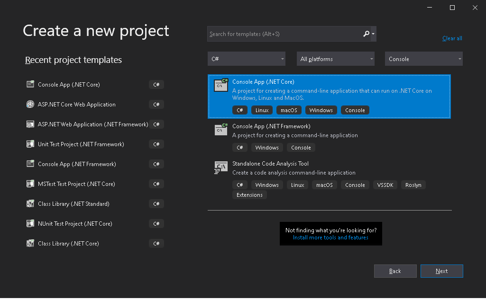
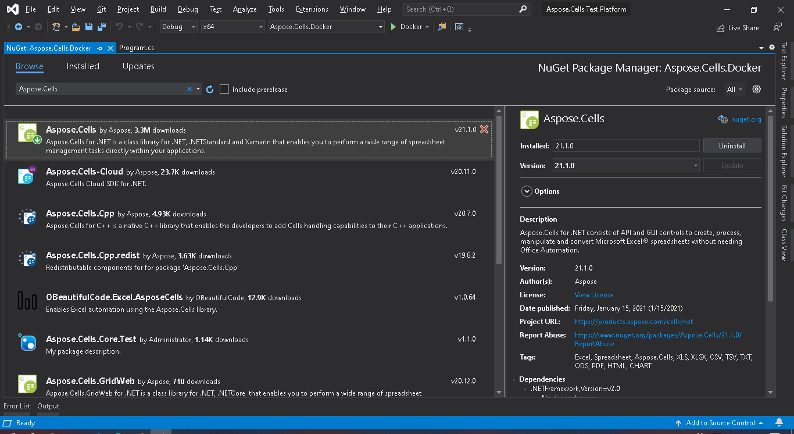

Microservices, in conjunction with containerization, make it possible to easily combine technologies. Docker allows you to easily integrate Aspose.Cells functionality into your application, regardless of what technology is in your development stack.

In case you are targeting microservices, or if the main technology in your stack is not .NET, C++ or Java, but you need Aspose.Cells functionality, or if you already use Docker in your stack, then you may be interested in utilizing Aspose.Cells in a Docker container.

## Prerequisites

- Docker must be installed on your system. For information on how to install Docker on Windows or Mac, refer to the links in the "See Also" section.

- Also, note that Visual Studio 2019 and the .NET Core 3.1 SDK are used in the example provided below.

## Hello World Application

In this example, you create a simple Hello World console application that creates a “Hello World!” document and saves it in all supported save formats. The application can then be built and run in Docker.

### Creating the Console Application

To create the Hello World program, follow the steps below:
1. Once Docker is installed, make sure that it uses Linux Containers (default). If necessary, select the **Switch to Linux containers** option from the Docker Desktop's menu.  
2. In Visual Studio, create a .NET Core console application. 
    
3. Install the latest Aspose.Cells version from NuGet. System.Drawing.Common and System.Text.Encoding.CodePages will be installed as dependencies of Aspose.Cells. 
    
4. Since the application will be run on Linux, the appropriate native Linux assets must be installed. Start with the .NET Core SDK 3.1 base image and install libgdiplus and libc6-dev.  
5. When all required dependencies are added, write a simple program that creates a “Hello World!” workbook and saves it in all supported save formats: 
**.NET** 

using System;
using Aspose.Cells;

namespace Aspose.Cells.Docker
{
    class Program
    {
        static void Main(string[] args)
        {
            Workbook workbook = new Workbook();
            workbook.Worksheets[0].Cells[0, 0].PutValue("Hello from Aspose.Cells!!!");
            foreach (SaveFormat sf in Enum.GetValues(typeof(SaveFormat)))
            {
                if (sf != SaveFormat.Unknown)
                {
                    try
                    {
                        // The folder specified will be mounted as a volume when the application is run in a Docker image.
                        var fileName = string.Format("out{0}", FileFormatUtil.SaveFormatToExtension(sf));
                        workbook.Save(fileName, sf);
                        Console.WriteLine("Saving {0}\t\t[OK]", sf);
                    }
                    catch
                    {
                        Console.WriteLine("Saving {0}\t\t[FAILED]", sf);
                    }
                }
            }
        }
    }
}


Note that the “TestOut” folder is specified as an output folder for saving output documents. When running the application in Docker, a folder on the host machine will be mounted to this folder in the container. This will enable you to easily view the output generated by Aspose.Cells in the Docker container.

### Configuring a Dockerfile

The next step is to create and configure the Dockerfile.

1. Create the Dockerfile and place it next to the solution file of your application. Keep the file name without an extension (the default).  
2. In the Dockerfile, specify:


FROM mcr.microsoft.com/dotnet/core/sdk:3.1-buster 
COPY fonts/* /usr/share/fonts/
WORKDIR /app
COPY . ./
RUN apt-get update && \
    apt-get install -y --allow-unauthenticated libgdiplus libc6-dev
RUN dotnet publish "Aspose.Cells.Docker.csproj" -c Release -o /app/publish
ENTRYPOINT ["dotnet", "publish/Aspose.Cells.Docker.dll"]


The above is a simple Dockerfile, which contains the following instructions:

- The SDK image to be used. Here it is the .NET Core SDK 3.1 image. Docker will download it when the build is run. The version of the SDK is specified as a tag.  
- Install fonts because the SDK image contains very few fonts. The command copies font files from the local machine to the Docker image. Make sure you have a local **fonts** directory that contains all the fonts you need to install. In this example, the local **fonts** directory is placed in the same directory as the Dockerfile.  
- The working directory, which is specified in the next line.  
- The command to copy everything to the container, publish the application, and specify the entry point.  
- The command to install libgdiplus is run in the container. This is required by System.Drawing.Common.

### Building and Running the Application in Docker

Now the application can be built and run in Docker. Open your favorite command prompt, change to the folder with the application (the folder where the solution file and the Dockerfile are placed), and run the following command:


docker build -t actest .


The first time this command is executed it may take longer, since Docker needs to download the required images. Once the previous command is completed, run the following command:


docker run --mount type=bind,source=C:\Temp,target=/TestOut --rm actest


{} 
Pay attention to the **mount** argument, because, as mentioned earlier, a folder on the host machine is mounted into the container’s folder to easily see the results of the application execution. Paths in Linux are case‑sensitive.
{}

## Images Supporting Aspose.Cells

- Aspose.Cells for .NET Standard does not support EMF and TIFF on Linux.

## More Examples

***1. To run the application in Windows Server 2019***

- Dockerfile


FROM microsoft/dotnet-framework:4.7.2-sdk-windowsservercore-ltsc2019
WORKDIR /app
COPY . ./
RUN dotnet publish "Aspose.Cells.Docker.csproj" -c Release -o /app/publish
ENTRYPOINT ["dotnet", "publish/Aspose.Cells.Docker.dll"]


- Build Docker Image


docker build -t actest .


- Run Docker Image


docker run --mount type=bind,source=C:\Temp,target=c:\TestOut --rm actest


***2. To run the application in Linux***

- Write a simple program that sets the font folder, creates a “Hello World!” workbook, and saves it.


namespace Aspose.Cells.Docker.Fonts
{
    using System;
    using System.IO;
    using Aspose.Cells;

    class Program
    {
        static void Main(string[] args)
        {
            try
            {
                // Set font folders on Linux.
                string[] fonts = { "/Fonts" };
                FontConfigs.SetFontFolders(fonts, true);
                // Build workbook
                Workbook workbook = new Workbook();
                MemoryStream memoryStream = new MemoryStream();
                workbook.Worksheets[0].Cells[0, 0].PutValue("Hello from Aspose.Cells!!!");
                Style style = workbook.CreateStyle();
                style.Font.Name = "Arial";
                style.Font.Size = 16;
                workbook.Worksheets[0].Cells[0, 0].SetStyle(style);
                workbook.Save("/TestOut/TestFontsOut.xlsx");
            }
            catch (Exception e)
            {
                Console.WriteLine("Saving outfonts.xlsx\t\t[FAILED],{0}", e.Message);
            }
        }
    }
}


- Dockerfile


FROM mcr.microsoft.com/dotnet/core/sdk:3.1-buster 
WORKDIR /app
COPY . ./
RUN apt-get update && \
    apt-get install -y --allow-unauthenticated libgdiplus libc6-dev
WORKDIR /app
COPY . ./
RUN dotnet publish "Aspose.Cells.Docker.Fonts.csproj" -c Release -o /app/publish
ENTRYPOINT ["dotnet", "publish/Aspose.Cells.Docker.Fonts.dll"]


- Build Docker Image


docker build -t actest .


- Run Docker Image


docker run --mount type=bind,source=C:\Windows\Fonts,target=/Fonts  --mount type=bind,source=C:\Temp,target=/TestOut --rm actest


## Recommended Solution

For .NET 6 (or later) platforms, compared with earlier platforms (.NET Core 3.1 or before), an important difference concerns the graphics library. In this official [Microsoft document](https://learn.microsoft.com/en-gb/dotnet/core/compatibility/core-libraries/6.0/system-drawing-common-windows-only) it explains that for .NET 6 or later releases the graphics library **System.Drawing.Common** will be supported only on Windows, and it provides recommendations to replace the graphics library.

Therefore, Aspose.Cells provides a solution that relies on the SkiaSharp graphics library on non‑Windows platforms. We recommend using SkiaSharp as the graphics library on macOS, which also means that there is no need to install libgdiplus.

For information on how to install Aspose.Cells on non‑Windows platforms and use SkiaSharp as the graphics library, please refer to the following article:  
[How to Run Aspose.Cells for .NET 6](https://docs.aspose.com/cells/net/how-to-run-aspose-cells-for-net6/)

## See Also

- [Install Docker Desktop on Windows](https://docs.docker.com/docker-for-windows/install/)
- [Install Docker Desktop on Mac](https://docs.docker.com/docker-for-mac/install/)
- [Visual Studio 2019, .NET Core 3.1 SDK](https://docs.microsoft.com/en-us/dotnet/core/install/windows?tabs=netcore31#dependencies)
- [Switch to Linux containers](https://docs.docker.com/docker-for-windows/#switch-between-windows-and-linux-containers) option
- Additional information on [.NET Core SDK](https://hub.docker.com/_/microsoft-dotnet-sdk)

