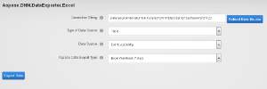
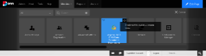

## **Introduction**

Aspose .NET DNN Data Exporter to Excel module allows users to export data directly from local or remote database tables, views, and custom queries into Microsoft Excel or OpenOffice Spreadsheet. This module demonstrates the powerful spreadsheet‑building feature provided by Aspose.Cells.

### **Module Features**

This initial version of the module is enriched with the following features to make the export process simple and easy to use:

- Allows connection to a local MS SQL Server database
- Allows connection to a remote MS SQL Server database
- Populates all tables from the connected database
- Populates all views from the connected database
- Allows writing custom queries
- Auto‑fits columns to content length
- Allows skipping strings longer than 32 KB in Excel cells (LoadOptions)
- Applies header‑column formatting as bold text
- Can be used as a data source (tables, views, custom query)
- Exports data to Microsoft Excel documents (.xls, .xlsx, and .xlsb)
- Exports data to tab‑delimited text documents (*.txt)
- Exports data to CSV (comma‑delimited) (*.csv)
- Exports data to OpenDocument Spreadsheet (*.ods)
- Option to select the desired output format before exporting
- Exported document is automatically sent to the browser for downloading

## **System Requirements and Supported Platforms**

### **System Requirements**

In order to set up Aspose.Cells .NET for DNN modules, you need to meet the following requirements:

- DNN 7.0 +

Please feel free to contact us if you wish to install these modules on other versions of DNN.

### **Supported Platforms**

Aspose.Cells .NET for DNN modules currently supports:

- DNN 7.0 +

Please feel free to contact us if you wish to install these modules on other versions of DNN.

## **Downloading**

You can download Aspose .NET Cells Database Data Exporter to Excel for DNN module from one of the following locations:

- [GitHub](https://github.com/aspose-cells/Aspose.Cells-for-.NET/releases/tag/AsposeCellsDNNDatatoExcel)

## **Installing**

Once downloaded, please follow these steps to install the module into your DNN website:

1. Log into your site as either Host or another super‑user level account.  
2. Navigate to the **Host** menu and select **Extensions**.  
3. Click **Install Extension Wizard**.  
4. As directed, browse to the location of the downloaded ZIP file, select it, then click **Open**.  
5. Click **Next**, accept the license, and continue through the install. When finished, click the **Return** button.  

Please check [this module installation video](https://www.dnnsoftware.com/community/learn/video-library/view-video/video/542/view/details/how-to-install-a-module-in-dotnetnuke-7) from DNN for more details.

## **Using**

After you have installed the Aspose .NET Database Data Exporter for DNN module, it is simple to start using it on your website. Please follow these steps to get started:

1. Make sure you are logged in to DNN with a Host or Admin level account.  
2. Navigate to the page where you want to add the Export module.  
3. Select **Modules** followed by **Add New Module** from the top ribbon.  
4. From the list, select **Aspose.NET DNN Data Exporter to Excel Using Aspose.Cells** and drag it into position.  

You have successfully added the Aspose .NET Database Data Exporter to Excel for DNN module to your page.

5. Enter or use a pre‑populated MS SQL Server connection string.  
6. Select the data source type (Table, View, Custom Query).  
7. Select or enter the data source (Table, View, Custom Query).  
8. Select the export type.  
9. Click **Export Data**.  
10. The desired file will be downloaded automatically.

## **Video Demo**

Please check [the video](https://www.youtube.com/watch?v=weqS_sq4FjI) below to see the module in action.

## **Support, Extend and Contribute**

### **Support**

From the very first days of Aspose, we knew that just giving our customers good products would not be enough. We also needed to deliver good service. We are developers ourselves and understand how frustrating it is when a technical issue or a quirk in the software stops you from doing what you need to do. We're here to solve problems, not create them.

This is why we offer free support. Anyone who uses our product, whether they have purchased it or are using an evaluation, deserves our full attention and respect.

You can log any issues or suggestions related to Aspose.Cells .NET for DNN modules using any of the following platforms:

- [Aspose Forum](https://forum.aspose.com/c/cells/9)

### **Extend and Contribute**

The Aspose .NET Cells Import Users from Excel module for DNN is open source, and its source code is available on the major social‑coding websites listed below. Developers are encouraged to download the source code and extend the functionality according to their own requirements.

#### **Source Code**

You can get the latest source code from one of the following locations:

- [GitHub](https://github.com/aspose-cells/Aspose.Cells-for-.NET)

#### **How to Configure the Source Code**

You need to have the following installed in order to open and extend the source code:

- Visual Studio 2010 or higher

Please follow these simple steps to get started:

1. Download/clone the source code.  
2. Open Visual Studio 2010 and choose **File** > **Open Project**.  
3. Browse to the downloaded source code and open, e.g., **Aspose.DNN.DatabaseDataExporterToExcel.sln**.
