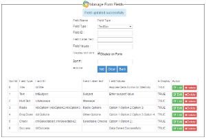
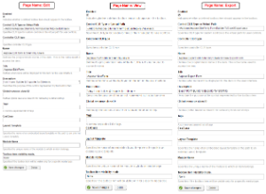
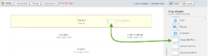

## **Introduction**

Aspose.Cells Dynamic Forms for Sitefinity Module allows users to generate dynamic questionnaires and surveys, save user input into an Excel spreadsheet, and export the results into Excel, text, CSV, and OpenDocument Spreadsheet using Aspose.Cells. This module demonstrates the powerful spreadsheet‑building feature provided by Aspose.Cells for .NET.

|

|
| :- |

### **Module Features**

This initial version of the module is enriched with the following features to make the forms‑building and export process simple and easy to use:

- Save Form Field Settings in Excel  
- Save Form’s User Input Data into Excel  
- Allow adding new and updating existing form fields  
- Allow adding TextBox, Multiline TextBox, RadioButton, CheckBox, and DropDownList (including DropDownList item‑type fields)  
- Allow adding/updating the label for each field  
- Allow showing/hiding form fields  
- Auto‑fit columns to content length and apply header column formatting as bold text  
- Export data to Microsoft Excel documents (.xls, .xlsx, and .xlsb)  
- Export data to a tab‑delimited text document (*.txt)  
- Export data to CSV (comma delimited) (*.csv)  
- Export data to OpenDocument Spreadsheet (*.ods)  
- Option to select desired output format before exporting  
- Exported document is automatically sent to the browser for downloading  

## **System Requirements and Supported Platforms**

In order to set up Aspose.Cells .NET for Sitefinity add‑ons you need to have the following requirements met:

- Sitefinity CMS running on ASP.NET 4.0  

Please feel free to contact us if you have any issues setting up this Sitefinity add‑on.

The add‑on is supported on all versions of

- Sitefinity CMS running on ASP.NET 4.0  

## **Downloading and Installing**

### **Downloading**

You can download Aspose .NET Content Exporter for Sitefinity module from one of the following locations:

- [GitHub](https://github.com/aspose-cells/Aspose.Cells-for-.NET/tree/master/Plugins/SiteFinity/Aspose.SiteFinity.FormBuilder.ToExcel)

### **Installing**

Once downloaded, please follow these steps to install the add‑on into your Sitefinity website:

**Step 1: Copy files to your Sitefinity installation**

Please extract the downloaded ZIP file. You will need FTP or direct access to the Sitefinity installation folder on the server to perform the following:

1. Copy **Aspose.Cells.dll** & **Aspose.Sitefinity.FormBuilder.dll** into the **bin** folder of the Sitefinity installation.  
2. Copy the **Addons** folder to the root of the Sitefinity installation where the **bin** folder is located.  

**Step 2: Register the Aspose Sitefinity Content Export add‑on in Sitefinity**

1. Log into your Sitefinity CMS with an **Administrator** account. The login page can be reached at <http://www.mywebsite.com/sitefinity>.  
2. Click **Administration** and then **Settings**. The Basic Settings page appears.  
3. Click the **Advanced** link. The Settings page appears.  
4. In the left pane, click **Toolboxes** followed by **Toolboxes**, then **PageControls**, **Sections**, **ContentToolboxSection**, and **Tools**.  
5. Click **Create new**. The widget registration form appears.  
6. Fill the form fields as follows:  
   1. Make sure **Enabled** is selected.  
   2. In the **Control CLR Type or Virtual Path** field, add **~/Addons/Aspose.SiteFinity.FormBuilder.ToExcel/Edit.ascx**.  
   3. Add **Name**, **Title**, and **Description** as follows:  
      - Aspose **PageName** (e.g., Edit, View, Export) form for Sitefinity users  
      - Aspose **PageName** Form (e.g., Aspose Edit Form, Aspose View Form, Aspose Export Form)  
      - **PageName** Form Builder & Exporter for Sitefinity.  
   4. You may leave all other fields as they are.  
   5. When finished, click **Save changes**.  
7. The widget is registered in the toolbox and can be used in Sitefinity. (**See below image**)

|

|
| :- |

## **Using and Video Demo**

### **Using**

After you have installed and configured the Aspose.Cells Dynamic Forms Builder for Sitefinity Users add‑on, it is really simple to start using it on your website. Please follow these simple steps to get started:

1. Make sure you are logged in to Sitefinity with an Administrator‑level account.  
2. Navigate to the page where you want to add the plugin. Make sure the page is opened in edit mode.  
3. From the **Drag Widgets** menu on the right, select Aspose Edit/View/Export Form and drag it into position. (**See below image**)

|

|
| :- |

You have successfully added Aspose.Cells Dynamic Form Builder for Sitefinity module to your page.

#### **How to Apply Aspose License?**

This plugin uses an evaluation version of Aspose.Cells. Once you are happy with your evaluation, you can purchase a license at the [Aspose Purchase Website](https://purchase.aspose.com/buy).  
To remove the evaluation message and feature limitations, the product license should be applied. You will receive a license file after you have purchased the product. Please follow the steps below to apply the license:

- Make sure the license file is named **Aspose.Total.lic**.  
- Place the **Aspose.Total.lic** file in the **App_Data** folder of your Sitefinity website, e.g., `Sitefinity Root Folder/App_Data/Aspose.Total.lic`.  

#### **Dynamic Forms Settings**

1. Make sure you are logged in, click on the Page menu, and click the first row’s **View** option button near the **Action** column.  
2. Click the **Edit** button available near the option label.  
3. There are a few pre‑defined fields; you can edit or hide them by clicking **Edit** in the grid.  
4. You can create, delete, or update new fields of any type (**TextBox, MultiLineTextBox, RadioButton, Checkboxes, DropDownList, Title, Success Message**).  

#### **Dynamic Form Submit**

1. Fill in the fields.  
2. Click the **Submit** button to save data.  
3. Each **Submit** button click will save a new record into Excel.  

#### **Export Saved Data**

1. Make sure you are logged in, go to the Pages menu, and click the first row’s view option button near the action column.  
2. Mouse over the **Export** icon and click it; the export page will open.  
3. Select **Export Type**.  
4. Click **Export Data**.  
5. The exported data file, according to the selected export type, will pop up for download or opening.  

You have successfully added Aspose Sitefinity Export Users to Excel.

### **Video Demo**

Please check [the video](https://www.youtube.com/watch?v=La5WMCvafR0) below to see the module in action.

## **Support, Extend and Contribute**

### **Support**

From the very first days of Aspose, we knew that just giving our customers good products would not be enough. We also needed to deliver good service. We are developers ourselves and understand how frustrating it is when a technical issue or a quirk in the software stops you from doing what you need to do. We're here to solve problems, not create them.

This is why we offer free support. Anyone who uses our product, whether they have bought it or are using an evaluation, deserves our full attention and respect.  
You can log any issues or suggestions related to Aspose.Cells .NET for Sitefinity modules using any of the following platforms:

- [GitHub](https://github.com/aspose-cells/Aspose.Cells-for-.NET/issues)

### **Extend and Contribute**

#### **Source Code**

You can download the latest source code at:

- [GitHub](https://github.com/aspose-cells/Aspose.Cells-for-.NET)

#### **How to Configure Source Code**

You need to have the following installed in order to open and extend the source code:

- Visual Studio 2013 or higher  

Please follow these simple steps to get started:

1. Download/clone the source code.  
2. Open Visual Studio 2013 and choose **File > Open Project**.  
3. Browse to the latest source code that you have downloaded and open the **.sln** file.
