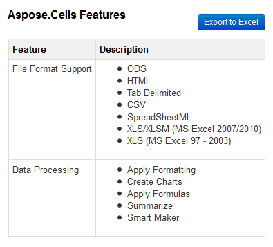
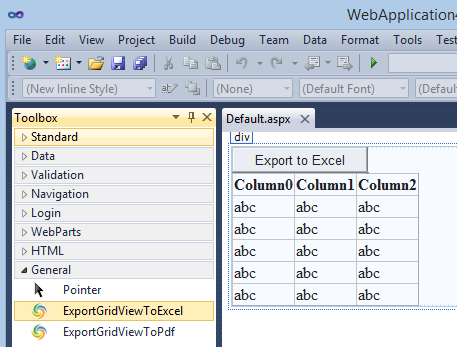
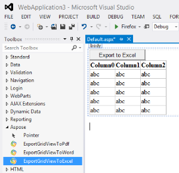

## **Introduction**
Export GridView To Excel Control is an ASP.NET server control which allows exporting contents of GridView into Microsoft Excel or OpenOffice spreadsheets using [Aspose.Cells](https://products.aspose.com/cells/net/). It adds **Export to Excel** button on top of the GridView control. Clicking the button dynamically exports the content of the GridView control to a Microsoft Excel or OpenOffice spreadsheet and then automatically downloads the exported file to the disk location selected by the user in just a couple of seconds.

### **Module Features**
This initial version of the control provides the following features:

- Get an offline copy of your favorite online GridView content for editing, sharing and printing.
- Inherited from the default ASP.NET GridView control and hence has all its features and properties.
- Export GridView to Xlsx, Xlsb, Xls, Txt, Csv, Ods.
- Works with all .NET versions starting from .NET 2.0.
- Ability to customize/localize Export button text.
- Apply look and feel of your own theme on Export button using CSS.
- Option to add custom heading on top of the exported document.
- Option to save each exported document on server at a configurable disk path.
- Option to export current page or all pages when paging is enabled.

This control allows you to export GridView in the following different file formats.

1. Export GridView to Excel  
2. Export GridView to Xlsx  
3. Export GridView to Xlsb  
4. Export GridView to Xls  
5. Export GridView to Txt  
6. Export GridView to Csv  
7. Export GridView to Ods  

## **System Requirements and Supported Platforms**
### **System Requirements**
Export GridView To Excel Control for Visual Studio can be used on any system that has IIS and .NET Framework 2.0 or greater installed.

### **Supported Platforms**
Export GridView To Excel Control for Visual Studio is supported on all versions of ASP.NET running on .NET Framework 2.0 or greater. You can use any of the following Visual Studio versions to use this control in your ASP.NET applications:

- Visual Studio 2005
- Visual Studio 2008
- Visual Studio 2010
- Visual Studio 2012
- Visual Studio 2013

## **Downloading**
You can download Export GridView To Excel Control from one of the following locations:

- [GitHub](https://github.com/aspose-cells/Aspose.Cells-for-.NET/releases/tag/Export_GridView_Excel)

## **Installing**
It is very simple and easy to install Export GridView To Excel Control; please follow these simple steps.

### **For Visual Studio 2010, 2012 and 2013**
1. Extract the downloaded zip file.  
2. Double‑click the VSIX file `Aspose.Excel.GridViewExport.vsix`.  
3. A dialog will appear showing you the available and supported Visual Studio versions installed on your machine.  
4. Select the ones you want to add the Export GridView To Excel Control to.  
5. Click **Install**.

You will get a success dialog once the installation is completed.

**Note:** Please make sure to restart Visual Studio for the changes to take effect.

### **For Visual Studio 2005, 2008 and Express editions**
Please follow these steps to integrate Export GridView To Excel Control in Visual Studio for easy drag‑and‑drop just like other ASP.NET controls.

1. Extract the downloaded zip file.  
2. Make sure to run Visual Studio as Administrator.  

   On the **Tools** menu, click **Choose Toolbox Items**.

3. Click **Browse**.  
   The Open dialog box appears.

4. Browse to the extracted folder and select `Aspose.Excel.GridViewExport.dll`.  

5. Click **OK**.

When you open an .aspx or .ascx control in the left‑side Toolbox you will see **ExportGridViewToExcel** under the **General** tab.

## **Using**
Once installed, it is very easy to start using this control in your ASP.NET applications.

| **For .NET Framework 4.0 and above** | **For .NET Framework 2.0 and above** |   |
| :- | :- | :- |
| For applications running in .NET Framework 4.0 and above in Visual Studio 2010 and above, you should see **ExportGridViewToExcel** control in the **Aspose** tab in the toolbar as shown below. You can simply drag‑drop this control onto your ASP.NET page, control, or master page just like any other .NET control and get started. | In order to use this control in applications running in .NET 2.0 in any Visual Studio version, make sure that you have added ExportGridViewToExcel to your toolbox as per instructions on [8.1.2.1 Downloading and Installing]() under the heading **For Visual Studio 2005, 2008 and Express editions**. You should see **ExportGridViewToExcel** control in the **General** tab in the toolbar as shown below. You can simply drag‑drop this control onto your ASP.NET page, control, or master page just like any other .NET control and get started. |   |
| 

 | 

 |   |

### **Manually adding ExportGridViewToExcel control**
If you have any issues using the above methods that use the Visual Studio Toolbox, you can manually add this control to your ASP.NET application running on any .NET Framework greater than 2.0.

1. If you are using Visual Studio, make sure to run it as Administrator.  
2. Add a reference to **Aspose.Excel.GridViewExport.dll** (available in the extracted download package) in your ASP.NET project or web application. Make sure your web application/Visual Studio has full access to this folder; otherwise you might get an “Access is denied” exception.  
3. Add this line to the top of the page, control, or master page:


<%@ Register assembly="Aspose.Excel.GridViewExport" namespace="Aspose.Excel.GridViewExport" tagprefix="aspose" %>


4. Add the following where you want the control to appear:


<aspose:ExportGridViewToExcel ID="ExportGridViewToExcel1" runat="server"></aspose:ExportGridViewToExcel>


### **FAQs**
Common questions and issues you might face while using this control.

| **#** | **Question** | **Answer** |
| :- | :- | :- |
| 1 | I cannot see ExportGridViewToExcel control in Toolbox | 
<strong>Visual Studio 2010 and higher</strong>

1. Make sure that you have installed this control using the VSIX extension file found in the downloaded package. To verify, go to **Tools → Extensions and Updates**. Under **Installed** you should see *Aspose Export GridView To Excel Control*. If you don’t see it, please try re‑installing.

2. Make sure your web application is running on .NET Framework 4.0 or higher; for lower versions, please check the alternate method above.

<strong>Older versions of Visual Studio</strong>

3. Make sure that you have manually added this control to your Toolbox as per the instructions above.
 |
| 2 | I am getting “Access is denied” error when running the application | 
1. If you are experiencing this problem in production, make sure that you copy both `Aspose.Cells.dll` and `Aspose.Excel.GridViewExport.dll` to your **bin** folder.

2. If you are using Visual Studio, make sure to run it as Administrator even if you are already logged in as an administrator.
 |

## **Aspose .NET Export GridView To Excel Control Properties**
The following properties are exposed to configure and use the features provided by this control.

| **Property Name** | **Type** | **Example / Possible values** | **Description** |
| :- | :- | :- | :- |
| ExportButtonText | string | Export to Excel | You can use this property to override the existing default text. |
| ExportButtonCssClass | string | btn btn-primary | CSS class applied to the outer `
` of the export button. To style the button itself, use `.yourClass input`. |
| ExportFileHeading | string | `<h4>GridView Export Example Report</h4>` | You can use HTML tags to add style to your heading. |
| ExportOutputFormat | enum | Xlsx, Xlsb, Xls, Txt, Csv, Ods | Output format of the exported document. |
| ExportOutputPathOnServer | string | `c:\temp` | Local disk path on the server where a copy of the export is automatically saved. The application must have write access to this path. |
| ExportDataSource | object | allRowsDataTable | Sets the object from which this data‑bound control retrieves its list of data items. Useful when custom paging is enabled and the current page fetches only the rows displayed on screen. |
| LicenseFilePath | string | `c:\inetpub\Aspose.Cells.lic` | Local path on the server to the license file. |

An example of Export GridView to Excel control with all properties used is shown below:


<aspose:ExportGridViewToExcel Width="800px" ID="ExportGridViewToExcel1" ExportButtonText="Export to Excel"
    CssClass="table table-hover table-bordered" ExportButtonCssClass="myClass" ExcelOutputFormat="xlsx"
    ExportOutputPathOnServer="c:\\temp" ExportFileHeading="<h1>Example Report</h1>"
    OnPageIndexChanging="ExportGridViewToExcel1_PageIndexChanging" PageSize="5" AllowPaging="True"
    LicenseFilePath="c:\\inetpub\\Aspose.Cells.lic" runat="server" CellPadding="4"
    ForeColor="#333333" GridLines="Both">
</aspose:ExportGridViewToExcel>


## **Video Demo**
Please check [the video](https://www.youtube.com/watch?v=_fSq_3TP1oM) below to see the module in action.

## **Support, Extend and Contribute**
### **Support**
From the very first days of Aspose, we knew that just giving our customers good products would not be enough. We also needed to deliver good service. We are developers ourselves and understand how frustrating it is when a technical issue or a quirk in the software stops you from doing what you need to do. We're here to solve problems, not create them.

This is why we offer free support. Anyone who uses our product, whether they have bought it or are using an evaluation, deserves our full attention and respect.

You can log any issues or suggestions related to this control using any of the following platforms:

- [GitHub](https://github.com/aspose-cells/Aspose.Cells-for-.NET/issues)

### **Extend and Contribute**
Aspose .NET Export GridView To Excel Control for Visual Studio is open source and its source code is available on the major social coding websites listed below. Developers are encouraged to download the source code and extend the functionality as per their own requirements.

#### **Source Code**
You can get the latest source code from one of the following locations:

- [GitHub](https://github.com/aspose-cells/Aspose.Cells-for-.NET/tree/master/Plugins)

#### **How to configure the source code**
You need to have the following installed in order to open and extend the source code:

- Visual Studio 2010

Please follow these simple steps to get started:

1. Download/clone the source code.  
2. Open Visual Studio 2010 and choose **File → Open Project**.  
3. Browse to the downloaded source code and open **Aspose.Excel.GridViewExport.sln**.

#### **Source code overview**
There are three projects in the solution:

- **Aspose.Excel.GridViewExport** – Contains the VSIX package and server control for .NET 4.0.  
- **Aspose.Excel.GridViewExport_DotNet_2.0** – Extended GridView control for .NET 2.0.  
- **Aspose.Excel.GridViewExport.Website** – Web project for testing the Excel‑exportable GridView control.
