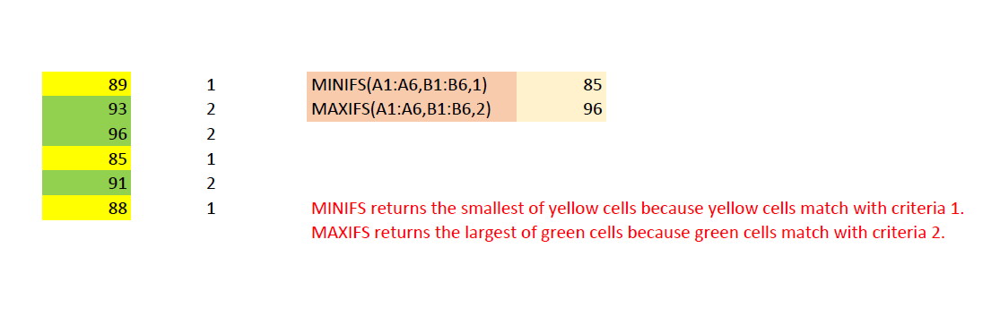

## **Possible Usage Scenarios**
Microsoft Excel 2016 supports MINIFS and MAXIFS functions. These functions are not supported in Excel 2013 or earlier versions. Aspose.Cells for Node.js via C++ also supports the calculation of these functions. The following screenshot illustrates the usage of these functions. Please read the red comments inside the screenshot to know how these functions work.



## **Calculation of Excel 2016 MINIFS and MAXIFS functions**
The following sample code loads the [sample excel file](5115149.xlsx) and calls the [Workbook.calculateFormula()](https://reference.aspose.com/cells/nodejs-cpp/workbook/#calculateFormula--) method to perform the formula calculation via Aspose.Cells for Node.js via C++, and then saves the results in the [output PDF](5115154.pdf).

```javascript
const path = require("path");
const AsposeCells = require("aspose.cells.node");

// The path to the documents directory.
const dataDir = path.join(__dirname, "data");
const sourceFilePath = path.join(dataDir, "sampleMINIFSAndMAXIFS.xlsx");

// Load your source workbook containing MINIFS and MAXIFS functions
const workbook = new AsposeCells.Workbook(sourceFilePath);

// Perform Aspose.Cells formula calculation
workbook.calculateFormula();

// Save the calculations result in pdf format
const options = new AsposeCells.PdfSaveOptions();
options.setOnePagePerSheet(true);
const outputFilePath = path.join(dataDir, "outputMINIFSAndMAXIFS.pdf");
workbook.save(outputFilePath, options);
```
