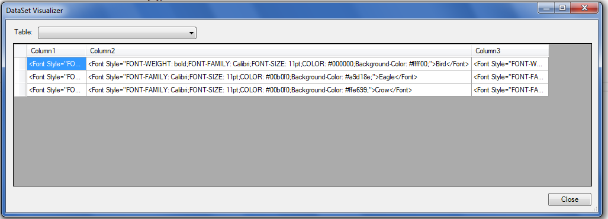

---  
title: Export HTML String Value of the Cells to the DataTable with Node.js via C++  
linktitle: Export HTML String Value of the Cells to the DataTable  
type: docs  
weight: 260  
url: /nodejs-cpp/export-html-string-value-of-the-cells-to-the-datatable/  
description: Learn how to export HTML string values of the cells to the DataTable using Aspose.Cells for Node.js via C++.  
keywords: Export HTML String Value of the Cells to the DataTable Node.js via C++, Export HTML String Value to the DataTable Node.js via C++  
---  
  
## **Possible Usage Scenarios**  
Using Aspose.Cells APIs, developers can fill a DataTable with corresponding HTML strings (based on cell values) while exporting worksheet data. This document explains how to export HTML strings for the formatted cell data to fill a DataTable using Aspose.Cells APIs.  
## **Export HTML String Value of the Cells to the DataTable**  
The following sample code illustrates how to export the HTML string value of the cells to the DataTable while exporting data from a worksheet into a DataTable. Please see the [sample Excel file](45056025.xlsx), its screenshot, and the console output for reference.  
## **Screenshot**  
  
## **Sample Code**  
```javascript
const path = require("path");
const AsposeCells = require("aspose.cells.node");

// The path to the documents directory.
const sourceDir = path.join(__dirname, "data");
// Load sample Excel file
const wb = new AsposeCells.Workbook(path.join(sourceDir, "sampleExportTableAsHtmlString.xlsx"));

// Access first worksheet
const ws = wb.getWorksheets().get(0);

// Specify export table options and set ExportAsHtmlString to true
const opts = new AsposeCells.ExportTableOptions();
opts.setExportColumnName(false);
opts.setExportAsHtmlString(true);

// Export the cells data to data table with the specified export table options
const dt = ws.getCells().exportDataTable(0, 0, 3, 3, opts);

// Print the cell html string value that is in third row and second column 
console.log(dt.getRows().get(2).get(1).toString());
```  
## **Console Output**  
  
  
 <Font Style="FONT-FAMILY: Calibri;FONT-SIZE: 11pt;COLOR: #00b0f0;Background-Color: #ffe699;">Crow</Font>  
  
  
  