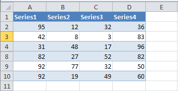

---  
title: Export Visible Rows Data from Worksheet with Node.js via C++  
linktitle: Export Visible Rows Data from Worksheet  
type: docs  
weight: 10  
url: /nodejs-cpp/export-visible-rows-data-from-worksheet/  
description: Learn how to export visible rows data from a worksheet using the Aspose.Cells for Node.js via C++.  
keywords: Export Visible Rows Data to DataTable Node.js via C++, Export unhidden Rows Data to DataTable Node.js via C++, Export Rows Data to DataTable and Exclude hidden rows Node.js via C++, Ignore Hidden Rows while Exporting Worksheet Data to Data Table Node.js via C++  
---  

{}  
You can export data from worksheets into data tables using Aspose.Cells. Sometimes you want to export the data of visible rows only. Aspose.Cells provides a way to achieve this. Use the [**ExportTableOptions.PlotVisibleRows**](https://reference.aspose.com/cells/nodejs-cpp/exporttableoptions/#plotVisibleRows-boolean) to specify that you want to export visible rows data only.  
{}  

This example shows how to export data from the following worksheet. Rows 5, 6, and 7 are hidden.  

|**Sample data in worksheet, rows 5, 6 and 7 are hidden**|  
| :- |  
||  

Once the data is exported to a data table using the [**Worksheet.Cells.exportDataTable()**](https://reference.aspose.com/cells/nodejs-cpp/cells/methods/exportdatatable/index) method with the [**ExportTableOptions.PlotVisibleRows**](https://reference.aspose.com/cells/nodejs-cpp/exporttableoptions/#plotVisibleRows-boolean) option, it will look like this. Hidden rows are plotted as blank rows  

|**Hidden rows are exported to the data table as blank rows**|  
| :- |  
||  

```javascript
const path = require("path");
const AsposeCells = require("aspose.cells.node");

// The path to the documents directory.
const dataDir = path.join(__dirname, "data");
const filePath = path.join(dataDir, "aspose-sample.xlsx");

// Load the source workbook
const workbook = new AsposeCells.Workbook(filePath);

// Access the first worksheet
const worksheet = workbook.getWorksheets().get(0);

// Specify export table options
const exportOptions = new AsposeCells.ExportTableOptions();
exportOptions.setPlotVisibleRows(true);
exportOptions.setExportColumnName(true);

// Export the data from worksheet with export options
const dataTable = worksheet.getCells().exportDataTable(0, 0, 10, 4, exportOptions);
```  
  