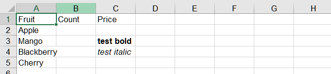

## **Possible Usage Scenarios**
When you need to set styled data for a specific cell, you can assign an HTML string to the cell. Of course, you can also obtain the HTML string of the cell. Aspose.Cells for Node.js via C++ offers this feature. Aspose.Cells provides the following properties and methods to help you achieve your goals.
- [**Cell.setHtmlString(string)**](https://reference.aspose.com/cells/nodejs-cpp/cell/#setHtmlString-string-)

## **Get and set HTML string using Aspose.Cells for Node.js via C++**
This example shows how to:

1. Create a workbook and add some data.
1. Get the specific cell in the first worksheet.
1. Set HTML string to the cell.
1. Get HTML string of the cell.



## Output generated by the sample code

The following screenshot shows the output of the above sample code.

