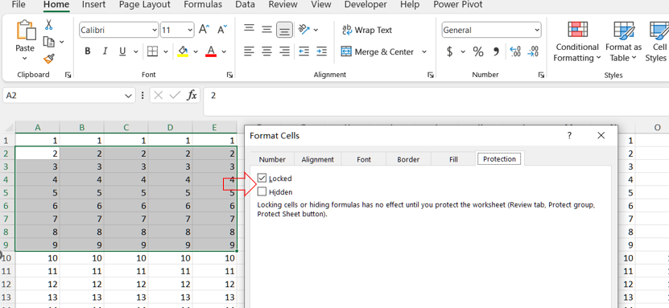
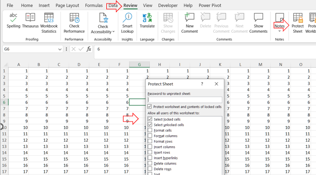

## **Possible Usage Scenarios**
Locking cells to protect them is a common practice in spreadsheet applications, such as Microsoft Excel or Google Sheets, for several important reasons:

1. Preventing Accidental Changes: Locking cells can prevent users from accidentally modifying important data or formulas. This is especially useful in complex spreadsheets where unintentional changes can lead to significant errors.

1. Maintaining Data Integrity: By locking cells, you can ensure that critical data remains consistent and accurate. This is crucial for financial documents, reports, and any other documents where data integrity is essential.

1. Controlled Access: In collaborative environments, locking cells allows you to control who can edit certain parts of a spreadsheet. For example, you might want to allow only certain team members to edit specific cells while keeping the rest of the worksheet protected.

1. Protecting Formulas: Formulas are often crucial for calculations and data analysis. Locking cells that contain formulas ensures that these formulas are not accidentally altered or deleted, which could disrupt the functionality of the entire worksheet.

1. Enforcing Business Rules: In some cases, specific business rules or regulations may require that certain data be protected from modification. Locking cells helps comply with these requirements.

1. Guiding Users: By locking cells and providing clear instructions on which cells can be edited, you can guide users on how to interact with the spreadsheet, reducing confusion and errors.

## **How to Lock Cells to Protect Them in Excel**
Here's how you can lock cells in Microsoft Excel:

1. Select the Cells to Lock: Select the cells you want to lock. If you want to lock the entire sheet, you can skip this step.
1. Open the Format Cells Dialog: Right-click on the selected cells and choose "Format Cells," or press Ctrl+1.
<br>

1. Lock the Cells: In the Format Cells dialog, go to the "Protection" tab. Check the "Locked" checkbox. Click "OK."
1. Protect the Worksheet: Go to the "Review" tab on the Ribbon. Click "Protect Sheet." Set a password (optional) and choose the permissions you want to allow (e.g., selecting locked cells, formatting cells, etc.). Click "OK."
<br>


## **How to Lock Cells to Protect Them Using Node.js**

Aspose.Cells is a powerful library for working with Excel files programmatically. To lock cells using Aspose.Cells for Node.js via C++, you need to follow these steps: load [sample file](sample.xlsx), unlock all cells first (since, by default, all cells are locked but not enforced until the worksheet is protected), then lock the specific cells you want to protect, and finally protect the worksheet to enforce the locking.

```javascript
const AsposeCells = require("aspose.cells.node");
const path = require("path");

// The path to the documents directory.
const dataDir = path.join(__dirname, "data");

// Load the Excel file
let workbook = new AsposeCells.Workbook(path.join(dataDir, "sample.xlsx"));

// Access the first worksheet
let sheet = workbook.getWorksheets().get(0);

// Unlock all cells first
let unlockStyle = workbook.createStyle();
unlockStyle.setLocked(false);

let styleFlag = new AsposeCells.StyleFlag();
styleFlag.setLocked(true);
sheet.getCells().applyStyle(unlockStyle, styleFlag);

// Lock specific cells (e.g., A1 and B2)
let lockStyle = workbook.createStyle();
lockStyle.setLocked(true);

sheet.getCells().get("A1").setStyle(lockStyle);
sheet.getCells().get("B2").setStyle(lockStyle);

// Protect the worksheet to enforce the locking
sheet.protect(AsposeCells.ProtectionType.All);

// Save the modified workbook
workbook.save(path.join(dataDir, "output_locked.xlsx"));
```

## **Output Result**
This code ensures that only the specified cells (A1 and B2 in this example) are locked, and the worksheet is protected to enforce these settings. All other cells in the worksheet remain unlocked and editable.

<br>


